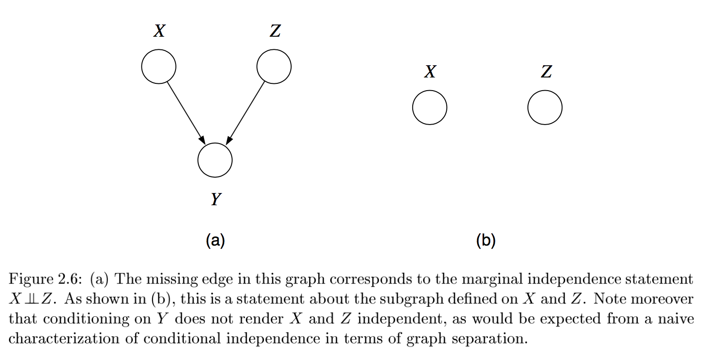
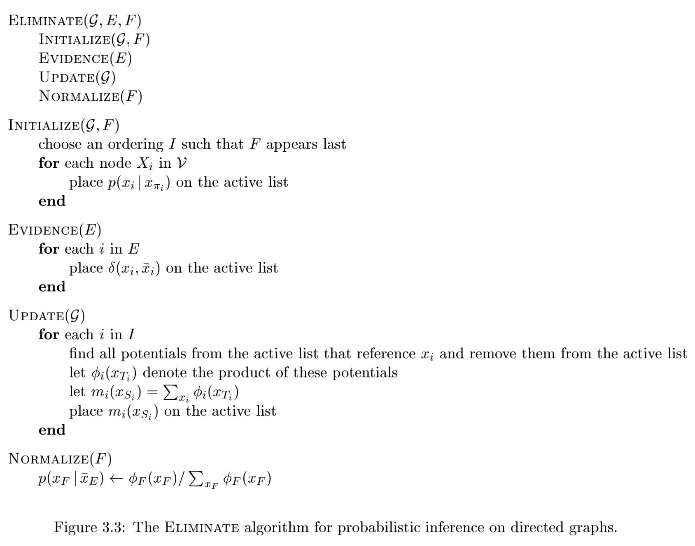
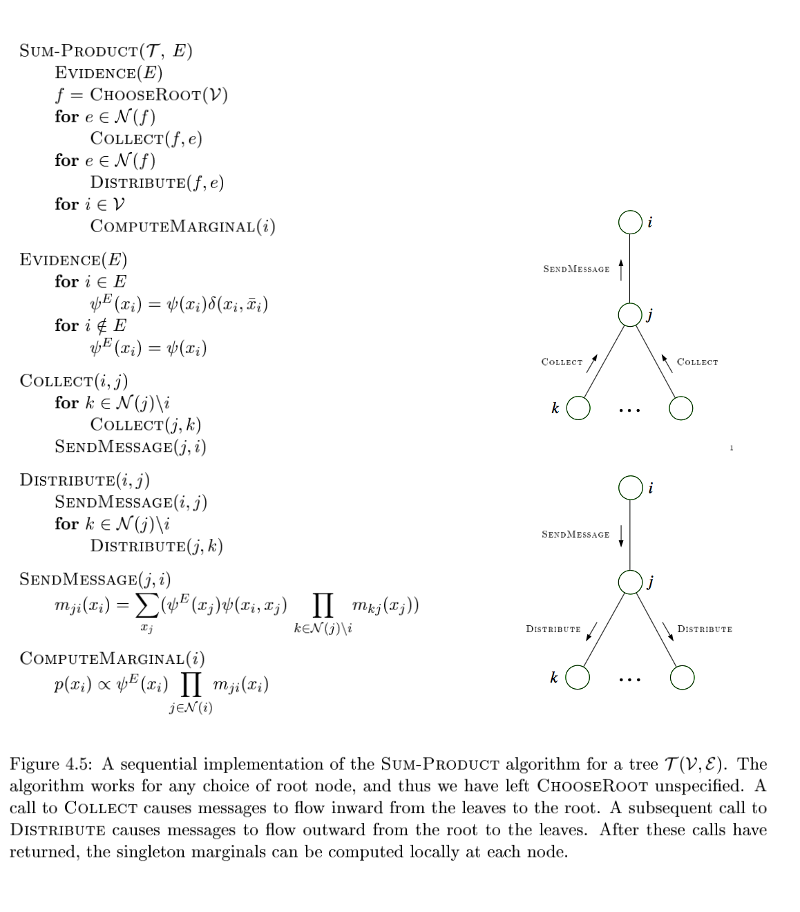
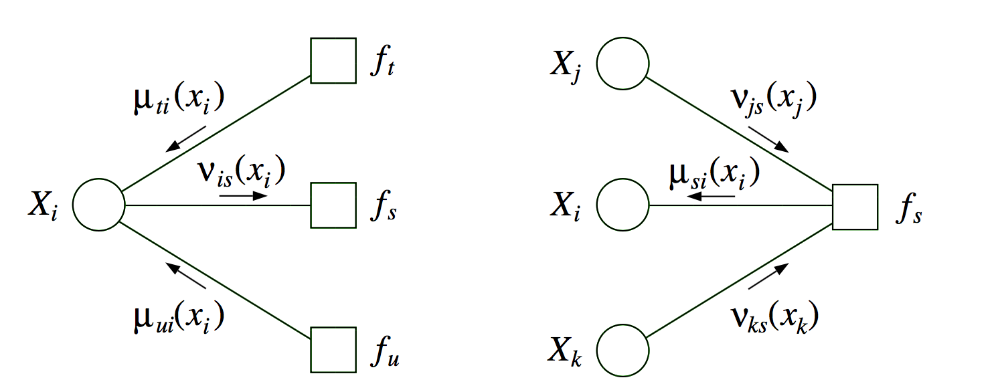

[TOC]

# overview

- *mixture models* - discrete latent variable vs. *factor analysis models* - continuous latent variable
- *bayesian networks* - directed vs. *undirected networks*

# structure learning

- marginal correlation - covariance matrix
    - estimates are bad when not n >> d
    - eigenvalues are not well-approximated
    - often enforce sparsity
    - ex. threshold each value in the cov matrix (set to 0 unless greater than thresh) - this threshold can depend on different things
    - can also use regularization to enforce sparsity
    - POET doesn't assume sparsity
- conditional correlation - inverse covariance matrix = precision matrix

# bayesian networks - R & N 14.1-5

- represented by directed acyclic graph

1. could get an expert to design Bayesian network
2. otherwise, have to learn it from data

- each node is random variable
- weights as tables of conditional probabilities for all possibilities

1. encodes conditional independence relationships
2. compact representation of joint prob. distr. over the variables

- *markov condition* - given its parents, a node is conditionally independent of its non-descendants
- therefore joint distr: $P(X_1 = x_1,...X_n=x_n)=\prod_{i=1}^n P(X_i = x_i \vert  Parents(X_i))$
- *inference* - using a Bayesian network to compute probabilities
  - sometimes have unobserved variables

- BN has no redundancy -> no chance for inconsistency
- forming a BN: keep adding nodes, and only previous nodes are allowed to be parents of new nodes
  - want *causal model* - causes are first, effects are later
  - *diagnostic model* - links from symptoms to causes
    - requires more dependencies
- *topological independence* - a node is independent of all other nodes given its parents, children, and children's parents = *markov blanket*
  - a node is conditionally independent of its non-descendants given its parents
- can have a *noisy-OR* relation - only requires k params not $2^k$

## hybrid BN (both continuous & discrete vars)

- for continuous variables, can sometimes discretize
1. when parents are discrete/continuous and child is continuous can use *linear Gaussian*
  - h is continuous, s is discrete; a,b,$\sigma$ all change when s changes
  - P(c\|h,s) = $N(a \cdot h + b, \sigma^2)$, so mean is linear function of h
  - if discrete parents, but not children, network defines *conditional Gaussian* - multivariate Gaussian given assignment to discrete variables
  - if only continuous variables, then linear Guassian yields a *multivariate Gaussian* over all the variables, and a multivariate posterior distribution (given any evidence)
2. continuous parents w/ discrete children
  1. *probit distr* - $P(buys\|Cost=c) = \phi((-c+\mu)/\sigma)$ - integral of standard normal distr
    - like a soft threshold
  2. *logit distr.* - $P(buys\|Cost=c)=\frac{1}{1+exp(-2 (-c + \mu) / \sigma)}$
    - logistic function produces thresh

## exact inference

- given assignment to *evidence variables*, find probs of *query variables*
  - other variables are *hidden variables*
- *polytree*=*singly connected network* - time and space complexity of exact inference is linear in the size of the network
  - holds even if the number of parents of each node is bounded by a constant
1. *enumeration* - just try everything
  - $O(n 2^n)$
  - ENUMERATION-ASK evaluates in depth-first order: $O(2^n)$
2. *variable elimination* - dynamic programming
  - every variable that is not an ancestor of a query variable or evidence variable is irrelevant to the query
  - picking order can be tricky
3. *clustering algorithms* = *join tree* algorithms
  - join individual nodes in such a way that resulting network is a polytree
  - can compute posterior probabilities in O(n)
    - however, conditional probability tables may still be exponentially large

## approximate inferences in BNs

- randomized sampling algorithms = *monte carlo* algorithms
1. *direct sampling* methods
  - sample network in topolgical order
    - more samples is better
  - *rejection sampling* - produces samples from a hard-to-sample distr. given an easy-to-sample distr.
    - want P(D\|A)
    - sample N times, throw out samples where A is false
    - return probability of D being true
    - this is slow
  - *likelihood weighting* - fix our evidence variables to their observed values, then simulate the network
    - can't just fix variables - distr. might be inconsistent
    - instead we weight by probability of evidence given parents, then add to final prob
    - for each observation
      - if correct, Count = Count+(1*W)
      - always, Total = Total+(1*W)
    - return Count/Total
    - this way we don't have to throw out wrong samples
    - doesn't solve all problems - evidence only influences the choice of downstream variables
2. *Markov chain monte carlo* - ex. *Gibbs sampling*, *Metropolis-Hastings*
  - fix evidence variables
  - sample a nonevidence variable $X_i$ conditioned on the current values of its Markov blanket
  - repeatedly resample one-at-a-time in arbitrary order
  - why it works
    - the sampling process settles into a dynamic equilibrium where time spent in each state is proportional to its posterior probability
    - provided transition matrix q is *ergodic* - every state is reachable and there are no periodic cycles - only 1 steady-state soln
3. *variational inference* - formulate inference as optimization
   - minimize KL-divergence between observed samples and assumed distribution

# conditional independence / factorization - J 2

- representations
  1. numerical representation of joint prob. distr.
    - helpful for constructing network
  2. set of conditional independencies
    - helpful for inference

## directed

- write p(x) or P(X)
  - $p(x_1, ..., x_n) = \prod_i p (x_i \| x_{\pi_i})$
- let $V_i$ be set of all nodes that appear earlier (topologically) than $i$ in the ordering excluding the parents $\pi_i$
  - $X_i \perp X_{V_i} \| x_{\pi_i}$
- conditional independencies will always be present
  - sometimes conditional dependencies can also be independent (if we pick p(y\|x) to not actually depend on x)
- multiple, competing explanation ("explaining-away")
  -   
  -  in fact any descendant of the base of the v suffices for explaining away
- *d-separation* = directed separation
- *Bayes ball algorithm* - is $X_A \perp X_B \| X_C$
  - initialize
    - shade $X_C$
    - place ball at each of $X_A$
    - if any ball reaches $X_B$, then not conditionally independent
  - rules
    - balls can't pass through shaded unless shaded is at base of v
    - balls pass through unshaded unless unshaded is at base of v

## undirected

- $X_A \perp X_C \| X_B$ if the set of nodes $X_B$ separates the nodes $X_A$ from $X_C$
- can't convert directed / undirected
- *clique* - fully connected
- *maximal clique* - cannot be extended
- potential function $\psi_{X_C} (x_C)$ function on possible realizations $x_C$ of the maximal clique $X_C$
  - non-negative, but not a probability
  - commonly let these be exponential, yielding *energy* and *Boltzmann distribution*
- $p(x) = \frac{1}{Z} \prod_{C \in Cliques} \psi_{X_C}(x_c)$
- $Z = \sum_x \prod_{C \in Cliques} \psi_{X_C} (x_C)$
- alternatively, could specify the conditional independencies
- *reduced parameterizations* - impose constraints on probability distributions (e.g. Gaussian)
- if x is dependent on all its neighbors
  - *Ising model* - if x is binary
  - *Potts model* - x is multiclass

# elimination - J 3

- the elimination algorithm is for *probabilistic inference*
- want $p(x_F\|x_E)$ where E and F are disjoint
- here let $X_F$ be a single node
- define $m_i (x_{S_i})$ as the expression that arises from performing the sum $\sum_{x_i}$, where $x_{S_i}$ are the variables, other than $x_i$, that appear in the summand
- define *evidence potential* $\delta(x_i, \bar{x_i})$ = 1 if $x_i == \bar{x_i}$ and 0 otherwise
  - then $$g(\bar{x_i}) = \sum_{x_i} \delta (x_i, \bar{x_i})$$
  - for a set $\delta (x_E, \bar{x_E}) = \prod_{i \in E} \delta (x_i, \bar{x_i})$
- now define $p^E(x) = p(x) \delta (x_E, \bar{x_E})$
- this lets us write $p^E (x) = \frac{1}{Z} \prod_{c\in C} \psi^E_{X_c} (x_c)$
  - condition on E, and find probability
  - in actuality don't compute the product, just take the correct slice
-  
- undirected graph elimination algorithm
  - for directed graph, first *moralize*
    - for each node connect its parents
    - drop edges orientation
  - for each node X
    - connect all remaining neighbors of X
    - remove X from graph
- *reconstituted graph* - same nodes, includes all edges that were added
  - *elimination cliques* - includes X and its neighbors when X is removed
  - computational complexity is the exponential in the number of variables in the elimination clique
  - involves *treewidth* - one less than smallest achievable value of cardinality of largest elimination clique
    - range over all possible elimination orderings
    - NP-hard to find elimination ordeirng that achieves the treewidth

# propagation factor graphs - J 4

## probabilistic inference on trees

- *tree* - undirected graph in which there is exactly one path between any pair of nodes
  - alternative defn? - every node has exactly one parent
  - $$p(x) = \frac{1}{Z} \left( \prod_{i \in V} \psi (x_i) \prod_{(i,j)\in E} \psi (x_i,x_j) \right)$$
  - if directed, then moralized graph should be a tree
   - can once again use evidence potentials for conditioning
- eliminate algorithm through message-passing
   - ordering I should be depth-first traversal (if undirected point all edges away from root)
      - *message* $m_{ji}(x_i)$ from $j$ to $i$ =*intermediate factor*
    - $m_{ji}(x_i) = \sum_{x_j} \left( \psi^E (x_j) \psi (x_i, x_j) \prod_{k \in N(j) \backslash i} m_{kj} (x_j) \right)$
    - $p(x_f \| \bar{x}_E) \propto \psi^E (x_f) \prod_{e \in N(f)} m_{ef} (x_f) $
- algorithm for probabilistic inference known as *sum-product* or *belief propagation* algorithm
  - computes all single-node marginals (for certain classes of graphs) rather than only a single marginal
  - only works in trees or tree-like graphs
  - works by reusing messages
  - *message-passing protocol* - a node can send a message to a neighboring node when, and only when, it has received messages from all of its other neighbors
    1. implement via a parallel algorithm
    2. implement via a two-phase schedule based on depth-first traversal
      -   

## factor graphs

- *factor graphs* capture factorizations, not conditional independence statements 
   - ex $\psi (x_1, x_2, x_3) = f_a(x_1,x_2) f_b(x_2,x_3) f_c (x_1,x_3)$ factors but has no conditional independence
    - $$f(x_1,...,x_n) = \prod_s f_s (x_{C_s})$$
    - neighborhood N(s) for a factor index s is all the variables the factor references
    - neighborhood N(i) for a node i is set of factors that reference $x_i$
    - provide more fine-grained representation of prob. distr.
       - could add more nodes to normal graphical model to do this
 - *factor tree* - if factors are made nodes, resulting undirected graph is tree
    - two kinds of messages (variable-> factor & factor-> variable)
     - 
     - $$p(x_i) \propto \prod_{s \in N(i)} \mu_{si} (x_i)$$
     - if a graph is orginally a tree, there is little to be gained from factor graph framework
        - sometimes factor graph is factor tree, but original graph is not
- *polytree* - directed graph that reduces to an undirected tree if we convert each directed edge to an undirected edge

## maximum a posteriori (MAP)

1. find $max_{x_F} p(x_F \| \bar{x}_E)$ 	
  - MAP-eliminate algorithm is very similar to before
   - 
   - products of probs tend to underflow, so take the log $max_x p^E (x) = max_x log p^E (x)$
   - can also derive a *max-product algorithm* for trees
 2. find $argmax_x p^E (x)$
    - can solve by keeping track of maximizing values of variables in max-product algorithm

# hmms R&N 15.1-15.5, J. 12 (hmm)

- agent maintains *belief state* of state variables $X_t$ given evidence variables $E_t$
  - *transition model* - $P(X_t\|X_{0:t-1})$
    - often assume this is *Markov* or other stationary process
  - *sensor model* - $P(E_t \| X_t)$
    - inference goes the other way
  - define $P(X_{0:t}, E_{1:t}) = P(X_0) \prod_{i} P(X_i \| X_{i-1}) P(E_i\|X_i)$
    - improve accuracy
      1. increase order of Markov process model
      2. increase set of state variables
      - hard to maintains state variables over time, want more sensors
- 4 inference problems
  1. *filtering* = *state estimation* - compute $P(X_t \| e_{1:t})$
    - use *recursive estimation* for message $f_{1:t+1} = \alpha FORWARD(f_{1:t}, e_{t+1}$
  2. *prediction* - compute $P(X_{t+k}\|e_{1:t})$ for 0<k
  3. *smoothing* - compute $P(X_{k}\|e_{1:t})$ for 0<k<t
  4. *most likely explanation* - $argmax_{x_{1:t}}P(x_{1:t}\|e_{1:t})$
2. *learning* - form of EM - learn  $(\pi,A,B)$
  1. supervised (given y)
    - basically just count (maximizing joint likelihood of input and output)
    - $\pi_s = \frac{count(start \to s)}{n}$
    - $A_{s',s} = \frac{count(s \to s')}{count(s)}$
    - $B_{s,x} = \frac{count (s \to x)}{count(s)}$
  2. unsupervised (not given y)
- goal 
  - learn distribution $P(x_1,...,x_n,y_1,...,y_n)$
    - ex. POS tagging
- model
  - define $P(x_1,...,x_n,y_1,...,y_n) =  P(y_1) P(x_1\|y_1) \prod_{i} P(y_i \| y_{i-1})$
  - each output label is dependent on its neighbors in addition to the input
- definitions
  - $\mathbf{y}$ - state 
    - states are not observed
  - $\mathbf{x}$ - observation 
  - $\pi$ - initial state probabilities
  - A = transition probabilities $P(y_2\|y_1)$
  - B = emission probabilities $P(x_1\|y_1)$
    - each state stochastically emits an observation

  - details
    - given $(\pi,A,B)$ and $\mathbf{x}$
      1. calculate probability of $\mathbf{x}$
      2. calculate most probable $\mathbf{y}$
      - use MAP:  $\hat{y}=\underset{y}{argmax} \: P(y\|x,\pi, A,B)=\underset{y}{argmax} \: P(y \land x \| \pi, A,B)$
    - use *Viterbi algorithm*
      1. initial for each state s
        - $score_1(s) = P(s) P(x_1 \| s) = \pi_s B_{x_1,s}$
      2. recurrence - for i = 2 to n, calculate scores using previous score only
        - $score_i(s) = \underset{y_i-1}{max} P(s\|y_{i-1}) P(x_i \| s) \cdot score_{i-1}(y_{i-1})$
      3. final state
        - $\hat{y}=\underset{y}{argmax} \: P(y,x \| \pi, A,B) = \underset{x}{max} \: score_n (s)$
    - complexity
      - K = number of states
      - M = number of observations
      - n = length of sequence
      - memory - nK
      - runtime - $O(nK^2)$