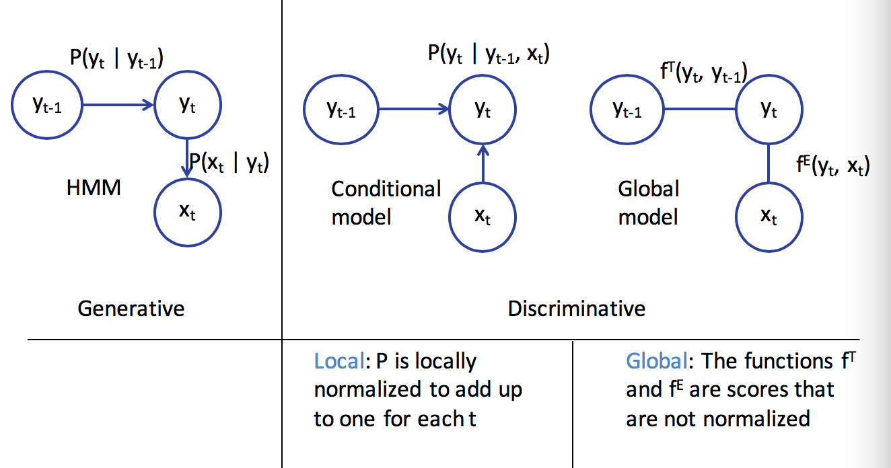
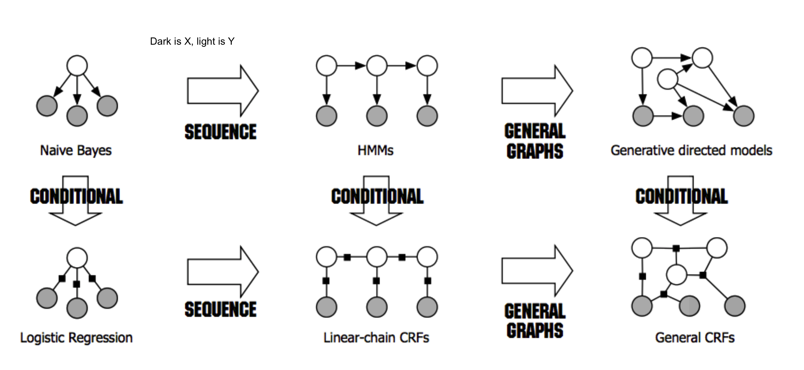

* TOC
{:toc}

[toc]

# 1 - introduction
1. *structured prediction* - have multiple independent output variables
	- output assignments are evaluated jointly
	- requires joint (global) inference
	- can't use classifier because output space is combinatorially large
	- three steps
		1. model - pick a model
		2. learning = training
		3. inference = testing
2. *representation learning* - picking features
	- usually use domain knowledge
	1. combinatorial - ex. map words to higher dimensions
	2. hierarchical - ex. first layers of CNN

# 2 - binary classification
- *learn* - learn w
	- $w$ should point to positive examples
- *inference* - predict
	- $\hat{y}=sign(w^T x)$
- losses
	- usually don't minimize 0-1 loss (combinatorial)
- usually $w^Tx$ includes b term, but generally we don't want to regularize b
1. *perceptron* - tries to find separating hyperplane
	- whenever misclassified, update w
		- can add in delta term to maximize margin
	- $\hat{w} = argmin_w \sum_i max(0,  -y_i \cdot w^T x_i)$
2. *linear svm*
	- $\hat{w} = argmin_w [w^Tw + C \sum_i max(0,1-y_i \cdot w^T x_i))]$
	- minimize norm of weights s.t. the closest points to the hyperplane have a score 1
	- stochastic sub-gradient descent
		- learning different ws differently
3. *logistic regression* = *log-linear model*
	- $\hat{w} = argmin_w [w^Tw + C \sum_i log(1+exp(-y_i \cdot w^T x_i))]$

# 3 - multiclass classification
- reducing multiclass (K categories) to binary
	- *one-against-all*
		- train K binary classifiers
		- class i = positive otherwise negative
		- take max of predictions
	- *one-vs-one* = *all-vs-all*
		- train C(K,2) binary classifiers
		- labels are class i and class j
		- inference - any class can get up to k-1 votes, must decide how to break ties
	- flaws - learning only optimizes *local correctness*
- single classifier
	- *multiclass perceptron* (Kesler)
		- if label=i, want $w_i ^Tx > w_j^T x \quad \forall j$
		- if not, update $w_i$ and $w_j$* accordingly
		- *kessler construction*
			- $w =  [w_1 ... w_k] $
			- want $w_i^T x > w_j^T x \quad \forall j$
			- rewrite $w^T \phi (x,i) > w^T \phi (x,j) \quad \forall j$
				- here $\phi (x,i)$ puts x in the ith spot and zeros elsewhere
				- $\phi$ is often used for feature representation
			- define margin: 
				$\Delta (y,y') = \begin{cases} 
				\delta& if y \neq y' \\\
				0& if y=y'
				\end{cases}$
			- check if $y=argmax_{y'}w^T \phi(x,y') + \delta (y,y')$
	- multiclass SVMs (Crammer&Singer)
		- minimize total norm of weights s.t. true label is score at least 1 more than second best label
	- multinomial logistic regression = multi-class *log-linear* model
		- $P(y\vert x,w)=\frac{exp(w^T_yx)}{\sum_{y' \in \{ 1,...,K\}} exp(w_{y'}^T,x)}$
			- we control the peakedness of this by dividing by stddev
		- *soft-max*: sometimes substitue this for $w^T_y x$

# 4 - neural networks
- if neurons within layer are connected, not feed-forward
- remember to include bias unit at every layer
- typically, first layer has (# input features)
- last layer has (# classes)
	- must convert labels to 1-of-K representation
- *perceptron convergence thm* - if data is linearly separable, perceptron learning algorithm wiil converge
- backprop yields a local optimum but works well in practice

# 5 - structure
- structured output can be represented as a graph
- outputs y
- inputs x
- two types of info are useful
	- relationships between x and y
	- relationships betwen y and y
- complexities
	1. modeling - how to model?
	2. train - can't train separate weight vector for each inference outcome
	3. inference - can't enumerate all possible structures
- need to score nodes and edges
	- could score nodes and edges independently
	- could score each node and its edges together
	
# 6 - sequential models

 

## sequence models
- goal: learn distribution $P(x_1,...,x_n)$ for sequences $x_1,...,x_n$
	- ex. text generation
- *discrete Markov model*
	- $P(x_1,...,x_n) = \prod_i P(x_i \vert  x_{i-1})$
	- requires 
		1. initial probabilites
		2. transition matrix
- *mth order Markov model* - keeps history of previous m states
- each state is an observation

## hidden Markov model - this is generative
- goal 
	- learn distribution $P(x_1,...,x_n,y_1,...,y_n)$
		- ex. POS tagging
- model
	- define $P(x_1,...,x_n,y_1,...,y_n) =  P(y_1) P(x_1\vert y_1) \prod_{i} P(y_i \vert  y_{i-1})$
	- each output label is dependent on its neighbors in addition to the input
- definitions
	- $\mathbf{y}$ - state 
		- states are not observed
	- $\mathbf{x}$ - observation 
	- $\pi$ - initial state probabilities
	- A = transition probabilities $P(y_2\vert y_1)$
	- B = emission probabilities $P(x_1\vert y_1)$
		- each state stochastically emits an observation
1. *inference*
	- given $(\pi,A,B)$ and $\mathbf{x}$
		1. calculate probability of $\mathbf{x}$
		2. calculate most probable $\mathbf{y}$
		- define $P(x_1,...,x_n,y_1,...,y_n) =  P(y_1) P(x_1\vert y_1) \prod_{i} P(y_i \vert  y_{i-1}) P(x_i\vert y_i)$
		- use MAP:  $\hat{y}=\underset{y}{argmax} \: P(y\vert x,\pi, A,B)=\underset{y}{argmax} \: P(y \land x \vert  \pi, A,B)$
	- use *Viterbi algorithm*
		1. initial for each state s
			- $score_1(s) = P(s) P(x_1 \vert  s) = \pi_s B_{x_1,s}$
		2. recurrence - for i = 2 to n, calculate scores using previous score only
			- $score_i(s) = \underset{y_i-1}{max} P(s\vert y_{i-1}) P(x_i \vert  s) \cdot score_{i-1}(y_{i-1})$
		3. final state
			- $\hat{y}=\underset{y}{argmax} \: P(y,x \vert  \pi, A,B) = \underset{x}{max} \: score_n (s)$
	- complexity
		- K = number of states
		- M = number of observations
		- n = length of sequence
		- memory - nK
		- runtime - $O(nK^2)$
2. *learning* - learn  $(\pi,A,B)$
	1. supervised (given y)
		- basically just count (maximizing joint likelihood of input and output)
		- $\pi_s = \frac{count(start \to s)}{n}$
		- $A_{s',s} = \frac{count(s \to s')}{count(s)}$
		- $B_{s,x} = \frac{count (s \to x)}{count(s)}$
	2. unsupervised (not given y)

## conditional models and local classifiers - discriminative model
- conditional models = discriminative models
	- goal: model $P(Y\vert X)$
	- learns the decision boundary only
	- ignores how data is generated (like generative models)
- ex. *log-linear models*
	- $P(\mathbf{y\vert x,w}) = \frac{exp(w^T \phi (x,y))}{\sum_y' exp(w^T \phi (x,y'))}$
	- training: $w = \underset{w}{argmin} \sum log \: P(y_i\vert x_i,w)$
- ex. *next-state model*
	- $P(\mathbf{y}\vert \mathbf{x})=\prod_i P(y_i\vert y_{i-1},x_i)$
- ex. *maximum entropy markov model*
	- $P(y_i\vert y_{i-1},x) \propto exp( w^T \phi(x,i,y_i,y_{i-1}))$
		- adds more things into the feature representation than HMM via $\phi$
	- has *label bias* problem
		- if state has fewer next states they get high probability
			- effectively ignores x if $P(y_i\vert y_{i-1})$ is too high
- ex. *conditional random fields=CRF* 
	- a global, undirected graphical model
		- divide into *factors*
	- $P(Y\vert x) = \frac{1}{Z} \prod_i exp(w^T \phi (x,y_i,y_{i-1}))$
		- $Z = \sum_{\hat{y}} \prod_i exp(w^T \phi (x,\hat{y_i},\hat{y}_{i-1}))$
		- $\phi (x,y) = \sum_i \phi (x,y_i,y_{i-1})$
	- prediction via Viterbi (with sum instead of product)
	- training
		- maximize log-likelihood $\underset{W}{max} -\frac{\lambda}{2} w^T w + \sum log \: P(y_I\vert x_I,w)$
		- requires inference
	- *linear-chain CRF* - only looks at current and previous labels
- ex. *structured perceptron*
	- HMM is a linear classifier

# 7 - graphical models
- graphical models represent prob. distributions over multiple random variables
-  

### 1 - Bayesian networks = causal networks (directed graphs)
- must be acyclic
- *local independence* - each node is independent of its non-descendants given its parents
	- $P(z_1,...,z_n)=\prod P(z_i\vert Parents(z_i))$
- *topological independence* - a node is independent of all other nodes given its parents, children, and children's parents = *markov blanket*
- compact representation of the joint prob. distr.
- *global independencies* - D-separation
- sometimes Bayes nets cannot represent the independence relations we want conveniently
	1. arrow direction unclear
	2. independencies structures can be strange

### 2 - Markov networks = Markov random fields (undirected graphs)
- each node is independent of its non-descendants given its immediate neighbors
- the nodes in a *complete subgraph* form a *clique*
	- *complete* - all connections present
- $P_\theta(X) = \frac{1}{Z(\theta)} \prod_{c \in Cliques} f(x_c,\theta)$
	- the joint probability decouples over cliques
	- every clique $x_c$ is associated with a potential function $f(x_c,\theta)$
	- partition function $Z(\theta) = \sum_x \prod_{c \in Cliques} f(x_c,\theta)$
- *local independence* - a node is independent of all other nodes given its neighbors
- *global interdependence* - if X,Y,Z are sets of nodes, X is conditionally independent of Y given Z if removing all nodes of Z removes all paths from X to Y
- *factor graph* - makes the factorization explicit
	- replaces cliques with factors
- if x is dependent on all its neighbors
	- *Ising model* - if x is binary
	- *Potts model* - x is multiclass

### learning
- train via maximum likelihood

### inference
- compute probability of subset of states
- exact inference
	- variable elimination
	- belief propagation
- approximate inference
	- MCMC
	- variational algorithms
	- loopy belief propagation
	
# 8 - constrained conditional models
## consistency of outputs and the value of inference
- ex. POS tagging - sentence shouldn't have more than 1 verb
- *inference*
	- a global decision comprising of multiple local decisions and their inter-dependencies
	1. local classifiers
	2. constraints
- *learning*
	- global - learn with inference (computationally difficult)

## constrained conditional models via an example

## hard constraints and integer programs
-  

## soft constraints
-  

# 9 - inference
- inference constructs the output given the model
- goal: find highest scoring state sequence
	- $argmax_y \: score(y) = argmax_y w^T \phi(x,y)$
- naive: score all and pick max - terribly slow
- *viterbi* - decompose scores over edges
- questions
	1. exact v. approximate inference
		- exact - search, DP, ILP
		- approximate = *heuristic* - Gibbs sampling, belief propagation, beam search, linear programming relaxations
	2. randomized v. deterministic
		- if run twice, do you get same answer
- *ILP* - integer linear programs
	- combinatorial problems can be written as integer linear programs
	- many commercial solvers and specialized solvers
	- NP-hard in general
	- special case of *linear programming* - minimizing/maximizing a linear objective function subject to a finite number of linear constraints (equality or inequality)
		- in general, $ c = \underset{c}{argmax}\: c^Tx $ subject to $Ax \leq b$
		- maybe more constraints like $x \geq 0$
		- the constraint matrix defines a polytype
		- only the vertices or faces of the polytope can be solutions
		- $\implies$ can be solved in polynomial time
	- in ILP, each $x_i$ is an integer
	- *LP-relaxation* - drop the integer constraints and hope for the best
	- 0-1 ILP - $\mathbf{x} \in \{0,1\}^n$
	- decision variables for each label $z_A = 1$ if output=A, 0 otherwise
	- don't solve multiclass classification with an ILP solver (makes it harder)
- *belief propagation*
	- variable elimination
		1. fix an ordering of the variables
		2. iteratively, find the best value given previous neighbors
			- use DP
		- ex. Viterbi is max-product variable elimination
	- when there are loops, require approximate solution
		- uses *message passing* to determine marginal probabilities of each variable
			- message $m_{ij}(x_j)$ high means node i believes $P(x_j)$ is high
		- use *beam search* - keep size-limited priority queue of states
		
# 10/11 - learning protocols
## structural svm
- $\underset{w}{min} \: \frac{1}{2} w^T w + C \sum_i \underset{y}{max} (w^T \phi (x_i,y)+ \Delta(y,y_i) - w^T \phi(x_i,y_i) )$

## empirical risk minimization
- subgradients
	- ex. $f(x) = max ( f_1(x), f_2(x))$, solve the max then compute gradient of whichever function is argmax
	
## sgd for structural svm
- highest scoring assignment to some of the output random variables for a given input?
- *loss-augmented inference* - which structure most violates the margin for a given scoring function?
- *adagrad* - frequently updated features should get smaller learning rates