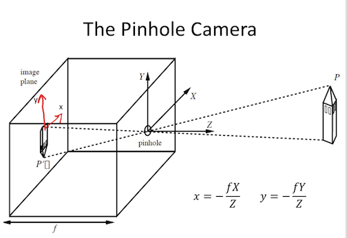
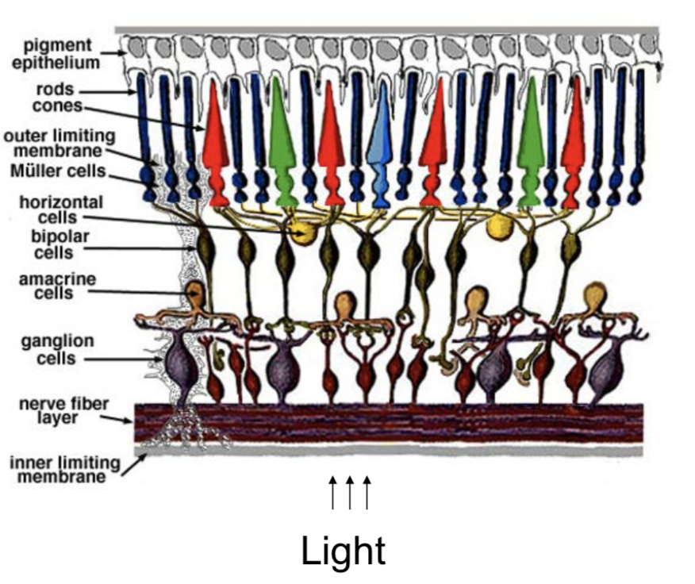
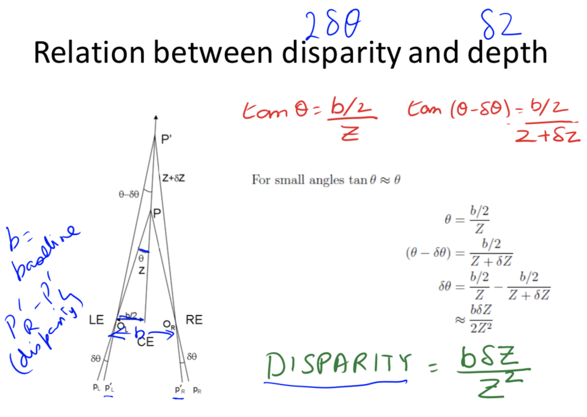
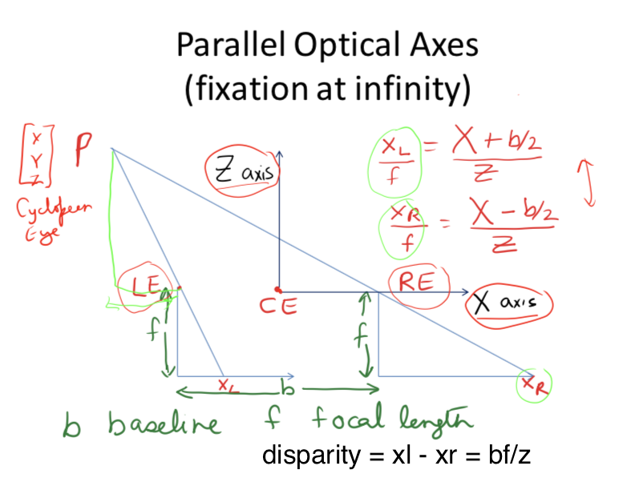
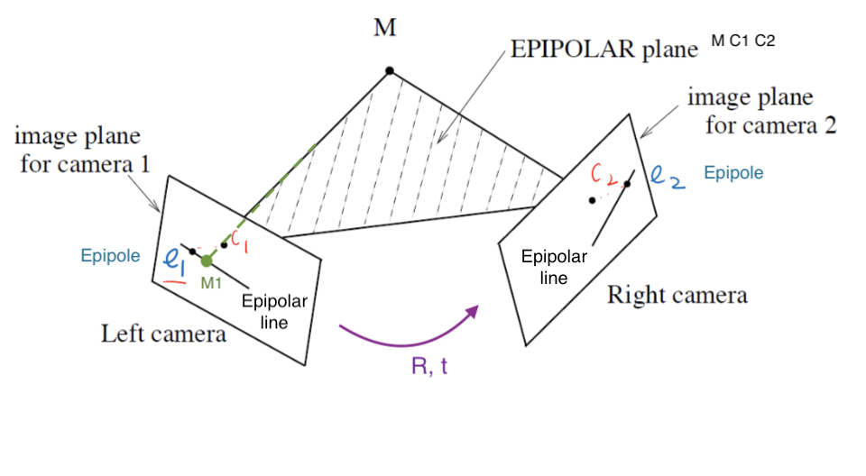
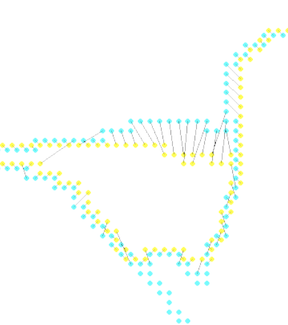

layout: notes
section-type: notes
title: Computer Vision
category: ml

* TOC
{:toc}
# what's in an image?

- vision doesn't exist in isolation - movement
- three R's: recognition, reconstruction, reorganization

## fundamentals of image formation

### projections

- image I(x,y) projects scene(X, Y, Z)
  - lower case for image, upper case for scene
  - 
    - box with pinhole=*center of projection*, which lets light go through
    - Z axis points out of box, X and Y aligned w/ image plane (x, y)
  - $x = \frac{-fX}{Z}$ (f is a fixed dist. not a function)
  - $y = \frac{-fY}{Z}$
- perspective projection - maps 3d points to 2d points through holes
  - 
  - perspective projection works for spherical imaging surface
    - what's important is 1-1 mapping between rays and pixels
  - natural measure of image size is visual angle
- **orthographic projection** - appproximation to perspective when object is relatively far
  - define constant $s = f/Z_0​$
  - transform $x = sX, y = sY$

### phenomena from perspective projection

- parallel lines converge to vanishing point (each family has its own vanishing point)
  - pf: point on a ray $[x, y, z] = [A_x, A_y, A_z] + \lambda [D_x, D_y, D_z]$
  - $x = \frac{fX}{Z} = \frac{f \cdot (A_x+\lambda D_X)}{A_z + \lambda D_z}$
  - $\lambda \to \infty \implies \frac{f \cdot \lambda D_x}{\lambda D_z} = \frac{f \cdot D_x}{D_z}$
  - $\implies$ vanishing point coordinates are $fD_x / D_z , f D_y / D_z$
  - not true when $D_z = 0$
  - all vanishing points lie on horizon
- nearer objects are lower in the image
  - let ground plane be $Y = -h$ (where h is your height)
  - point on ground plane $y = -fh / Z$
    - smaller z $\implies$ more negative y
- nearer objects look bigger
  - scaling factor is $1/Z$
- *foreshortening* - objects slanted w.r.t line of sight become smaller w/ scaling factor cos $\sigma$ ~ $\sigma$ is angle between line of sight and the surface normal

## radiometry

- *irradiance* - how much light (photons) are captured in some time interval
  - radiant power / unit area ($W/m^2$)
  - *radiance* - power in given direction / unit area / unit solid angle
    - L = directional quantity (measured perpendicular to direction of travel)
- irradiance $\propto$ radiance in direction of the camera
- outgoing radiance of a patch has 3 factors
  - incoming radiance from light source
  - angle between light / camera
  - reflectance properties of patch
- 2 special cases
  - *specular surfaces* - outgoing radiance direction obeys angle of incidence
  - *lambertian surfaces* - outgoing radiance same in all directions
    - albedo * radiance of light * cos(angle)
  - often model reflectance as a combination of Lambertian term and specular term
- also illuminated by reflections of other objects (ray tracing / radiosity)
- *shape-from-shading* (SFS) goes from irradiance -> geometry, reflectances, illumination

## frequencies and colors

- contrast sensitivity depends on frequency (also color)
  - 
- fourier transform - low vs high freqs
- band-pass filtering - use gaussian pyramid
  - pyramid blending
- eye
  - *iris* - colored annulus w/ radial muscles
  - *pupil* - hole (aperture) whose size controlled by iris
  - *retina*: 
- colors are what is reflected
- cones (short = blue, medium = green, long = red)
- *metamer* - 2 different but indistinguishable spectra
- color spaces
  - rgb - easy for devices
    - chips tend to be more green
  - hsv (hue, saturation, value)
  - lab (perceptually uniform color space)
- *color constancy* - ability to perceive invariant color despite ecological variations
- camera white balancing (when entire photo is too yellow or something)
  - manual - choose color-neutral object and normalize
  - automatic (AWB)
    - grey world - force average color to grey
    - white world - force brightest object to white

# image processing

## transformations

- 2 object properties
    - *pose* - position and orientation of object w.r.t. the camera (6 numbers - 3 translation, 3 rotation)
    - *shape* - relative distances of points on the object
      - nonrigid objects can change shape

| Transform (most general on top)                    | Constraints   | Invariants|                         2d params | 3d params |
| ---------------------------------------------------- | --------------------------------------- | --------- | --------- | --------- |
| Projective = homography (contains perspective proj.) | Ax + t, A nonsingular, homogenous coords | parallel -> intersecting | 8 (-1 for scale) |15 (-1 for scale)|
| Affine                                               | Ax + t, A nonsingular                   | parallelism, midpoints, intersection | 6=4+2 |12=9+3|
| Euclidean = Isometry                                 | Ax + t, A orthogonal                    | length, angles, area | 3=1+2 |6=3+3|
| Orthogonal (rotation when det = 1 / reflection when det = -1) | Ax, A orthogonal                        |           | 1 |3|

- **projective transformation** = **homography**

  - **homogenous coordinates** - use n + 1 coordinates for n-dim space
    - $[x, y] \to [x_1, x_2, x_3]$ with $x = x_1/x_3, y=x_2/x_3$
    - want to be able to use infinity - added coordinate helps us represent infinity
    - $[x_1, x_2] = \lambda [x_1, x_2]  \quad \forall \lambda \neq 0$ - each points is like a line through origin in n + 1 dimensional space
    - even though we added a coordinate, didn't add a dimension
    - standardize - make third coordinate 1 (then top 2 coordinates are euclidean coordinates)
      - when third coordinate is 0, other points are infinity
      - all coordinates 0 disallowed
    - Euclidean line $a_1x + a_2y + a_3=0$ to homogenous eqn for line $a_1 x_1 + a_2x_2 + a_3 x_3 = 0$
  - perspective maps parallel lines to lines that intersect
  - incidence of points on lines
    - when does a point $[x_1, x_2, x_3]$ lie on a line $[a_1, a_2, a_3]$ (homogenous coordinates)
    - when $\mathbf{x} \cdot \mathbf{a} = 0$
  - cross product gives intersection of any 2 lines
  - representing affine transformations
    - multiply by a matrix, but bottom row of affine transformation is [0, 0, 1]
    - $\begin{bmatrix}X'\\Y'\\W'\end{bmatrix} = \begin{bmatrix}a_{11} & a_{12}  & t_x\\ a_{21} & a_{22} & t_y \\ 0 & 0 & 1\end{bmatrix}\begin{bmatrix}X\\Y\\1\end{bmatrix}$
      - derivs are same as for normal affine transformations
  - representing **perspective projection**
    - $\begin{bmatrix}1 & 0& 0 & 0\\ 0 & 1 & 0 & 0 \\ 0 & 0 & 1/f & 0 \end{bmatrix} \begin{bmatrix}X\\Y\\Z \\ 1\end{bmatrix} = \begin{bmatrix}X\\Y\\Z/f\end{bmatrix} = \begin{bmatrix}fX/Z\\fY/Z\\1\end{bmatrix}​$
- **affine transformation**
  - affine transformations are also a a group
  - 2D - 6 parameters
  - examples
    - anisotropic scaling - ex. $\begin{bmatrix}2 & 0 \\ 0 & 1 \end{bmatrix}$
    - shear
  - tangent: three medians (vertex - midpoint of other side) of a triangle intersect
    - pf: can convert any triangle to another triangle via affine transform
      - can convert to equilateral triangle where it's obvious they intersect
- **euclidean transformations** = *isometries* = *rigid body transform*
  - preserves distances between pairs of points: $||\psi(a) - \psi(b)|| = ||a-b||$
    - ex. translation $\psi(a) = a+t$
  - $\implies$ orthogonal transformation preserves norms
  - $\implies$ orthogonal transformation are isometries
  - composition of 2 isometries is an isometry - they are a group
- **orthogonal transformations** - preserves inner products $\forall a,b \: a \cdot b =a^T A^TA b$
  - $\implies A^TA = I \implies A^T = A^{-1}$
  - $\implies det(A) = \pm 1$
    - 2D
      - really only 1 parameter $ \theta$ (also for the +t)
      - $A = \begin{bmatrix}cos \theta & - sin \theta \\ sin \theta & cos \theta \end{bmatrix}$ - rotation, det = +1
      - $A = \begin{bmatrix}cos \theta & sin \theta \\ sin \theta & - cos \theta \end{bmatrix}$ - reflection, det = -1
    - 3D
      - really only 3 parameters
      - ex. $A = \begin{bmatrix}cos \theta & - sin \theta  & 0 \\ sin \theta & cos \theta & 0 \\ 0 & 0 & 1\end{bmatrix}$ - rotation, det rotate about z-axis (like before)

- **rotation** - orthogonal transformations with det = +1 
  - 2D: $\begin{bmatrix}cos \theta & - sin \theta \\ sin \theta & cos \theta \end{bmatrix}$
  - 3D: $ \begin{bmatrix}cos \theta & - sin \theta  & 0 \\ sin \theta & cos \theta & 0 \\ 0 & 0 & 1\end{bmatrix}$ (rotate around z-axis)
- lots of ways to specify angles
  - axis plus amount of rotation - we will use this
  - euler angles
  - quaternions (generalize complex numbers)
- **Roderigues formula** - converts: $R = e^{\phi \hat{s}} = I + sin [\phi] \: \hat{s} + (1 - cos \phi) \hat{s}^2$
  - $s$ is a unit vector along $w$ and $\phi=||w||t$ is total amount of rotation
    - $\hat{s}$ is skew symmetric matrix for s
  - rotation matrix
    - can replace cross product with matrix multiplication with a skew symmetric matrix:
    - skew symmetric $B^T = -B$
    - $\begin{bmatrix} t_1 \\ t_2 \\ t_3\end{bmatrix}$ ^ $\begin{bmatrix} x_1 \\ x_2 \\ x_3 \end{bmatrix} = \begin{bmatrix} t_2 x_3 - t_3 x_2 \\ t_3 x_1 - t_1 x_3 \\ t_1 x_2 - t_2 x_1\end{bmatrix}$
      - $\hat{t} = \begin{bmatrix}  0 & -t_3 & t_2 \\ t_3 & 0 & -t_1 \\ -t_2 & t_1 & 0\end{bmatrix}$
  - proof
    - $\dot{q(t)} = \hat{w} q(t)$
    - $\implies q(t) = e^{\hat{w}t}q(0)$
    - where $e^{\hat{w}t} = I + \hat{w} t + (\hat{w}t)^2 / w! + ...$
      - can rewrite in terms above

## image preprocessing

- image is a function from $R^2 \to R$
- f(x,y) = reflectance(x,y) * illumination(x,y)
- need to map high dynamic range (HDR) to 0-255 by ignoring lots of values
  - do this with long exposure
  - *point processing* does this transformation independent of position x, y
- can enhance photos with different functions
  - negative - inverts
  - log - can bring out details if range was too large
  - contrast stretching - stretch the value within a certain range (high contrast has wide histogram of values)
- sampling
  - sample and write function's value at many points
  - reconstruction - make samples back into continuous function
  - ex. audio -> digital -> audio
  - undersampling loses information
  - **aliasing** - signals traveling in disguise as other frequencies
    - 
    - 
  - antialiasing
    - can sample more often
    - make signal less wiggly by removing high frequencies first
- filtering
  - *lowpass filter* - removes high frequencies
  - *linear filtering* - can be modeled by convolution
  - *cross correlation* - what cnns do, dot product between kernel and neighborhood
    - *sobel* filter is edge detector
  - *gaussian filter* - blur, better than just box blur
    - rule of thumb - set filter width to about 6 $\sigma$
    - removes "high-frequency" components
  - **convolution** - cross-correlation where filter is flipped horizontally and vertically
    - commutative and associative
    - **convolution theorem**: $F[g*h] = F[g]F[h]$ where F is Fourier, * is convolution
      - convolution in spatial domain = multiplication in frequency domain
- resizing
  - Gaussian (lowpass) then subsample to avoid aliasing
  - image pyramid - called pyramid because you can subsample after you blur each time
    - whole pyramid isn't much bigger than original image
    - *collapse* pyramid - keep upsampling and adding
    - good for template matching, search over translations
- sharpening - add back the high frequencies you remove by blurring (laplacian pyramid): 

## edges, templates, & texture

- **edge** - place of rapid change in the image intensity function
- solns

  - smooth first, then take gradient
  - gradient first then smooth gives same results (linear operations are interchangeable)
- *derivative theorem of convolution* - differentiation can also be though of as convolution

  - can convolve with deriv of gaussian
  - can give orientation of edges
- always tradeoff between smoothing (denoising) and good edge localization (not getting blurry edges)
- canny edge detector

  1. filter image w/ deriv of Gaussian
  2. find magnitude + orientation of gradient
  3. **non-maximum suppression** - does thinning, check if pixel is local maxima
      - anything that's not a local maximum is set to 0
      - on line direction, require a weighted average to interpolate between points (bilinear interpolation = average on edges, then average those points)
  4. **hysteresis thresholding** - high threshold to start edge curves then low threshold to continue them
- filter review
  - smoothing
    - no negative values
    - should sum to 1 (constant response on constant)
  - derivative
    - must have negative values
    - should sum to 0 (0 response on constant)
      - intuitive to have positive sum to +1, negative sum to -1
- matching with filters (increasing accuracy, but slower)
  - **think about how to compute these w/ convolution**
  - ex. zero-mean filter subtract mean of patch from patch (otherwise might just match brightest regions)
  - ex. SSD - L2 norm with filter
    - doesn't deal well with intensities
  - ex. normalized cross-correlation
- recognition
  - instance - "find me this particular chair"
    - simple template matching can work
  - category - "find me all chairs"
- *texture* - non-countable stuff
  - related to material, but different
- texture analysis - compare 2 things, see if they're made of same stuff
  - pioneered by bela julesz
  - random dot stereograms - eyes can find subtle differences in randomness if fed to different eyes
  - human vision sensitive to some difference types, but not others

## texture synthesis

- easy to classify textures based on v1 gabor-like features
  - can make histogram of filter response histograms
- heeger & bergen siggraph 95 - given texture, want to make more of that texture
  - start with noise
  - match histograms of noise with each of your filter responses
  - combine them back together to make an image
  - repeat this iteratively
- simoncelli + portilla 98 - also match 2nd order statistics (match filters pairwise)
  - much harder, but works better
- **texton histogram matching**  - classify images
  - use "computational version of textons" - histograms of joint responses
    - like bag of words but with "visual words"
    - won't get patches with exact same distribution, so need to extract good "words"
    - define words as k-means of features from 10x10 patches 
      - features could be raw pixels
      - gabor representation ~10 dimensional vector
      - SIFT features: histogram set of oriented filters within each box of grid
      - HOG features
      - usually cluster over a bunch of images
      - invariance - ex. blur signal
  - each image patch -> a k-means cluster so image -> histogram
  - then just do nearest neighbor on this histogram (chi-squared test is good metric)
- object recognition is really texture recognition
- all methods follow these steps
  - compute low-level features
  - aggregate features - k-means, pool histogram
  - use as visual representation
- why these filters - sparse coding (data driven find filters)

## optical flow

- simplifying assumption - world doesn't move, camera moves
  - lets us always use projection relationship $x, y = -Xf/Z, -Yf/Z$
- **optical flow** - movement in the image plane
  - square of points moves out as you get closer
    - as you move towards something, the center doesn't change
    - things closer to you change faster
  - if you move left / right points move in opposite direction
    - rotations also appear to move opposite to way you turn your head
- equations
  - optical flow at $(u, v) = (\Delta x / \Delta t,  \Delta y/ \Delta t)$ in time $\Delta t$
    - function in image space (produces vector field)
  - $\dot{X} = -t -\omega \times X$
- translational component of flow fields is more important - tells us $Z(x, y)$ and translation $t$
- we can compute the time to contact

# cogsci / neuro
## psychophysics

- julesz search experiment
  - "pop-out" effect of certain shapes (e.g. triangles but not others)
  - axiom 1: human vision has 2 modes
    - **preattentive vision** - parallel, instantaneous (~100-200 ms)
      - large visual field, no scrutiny
      - surprisingly large amount of what we do
      - ex. sensitive to size/width, orientation changes
    - **attentive vision** - serial search with small focal attention in 50 ms steps
  - axiom 2: textons are the fundamental elements in preattentive vision
    - texton is invariant in preattentive vision 
    - ex. elongated blobs (rectangles, ellipses, line segments w/ orientation/width/length)
    - ex. terminators - ends of line segments
    - crossing of line segments
- **julesz conjecture** (not quite true) - textures can't be spontaneously discriminated if they have same first-order + second-order statistics
  - ex. density
- humans can saccade to correct place in object detection really fast (150 ms - Kirchner & Thorpe, 2006)
  - still in preattentive regime
  - can also do object detection after seeing image for only 40 ms

## neurophysiology

- on-center off-surround - looks like Laplacian of a Gaussian
  - horizontal cell "like convolution"
- LGN does quick processing
- hubel & wiesel - single-cell recording from visual cortex in v1
- 3 v1 cell classes
  - *simple cells* - sensitive to oriented lines
    - oriented Gaussian derivatives
    - some were end-stopped
  - *complex cells* - simple cells with some shift invariance (oriented lines but with shifts)
    - could do this with maxpool on simple cells
  - *hypercomplex cells* (less common) - complex cell, but only lines of certain length
- *retinotopy* - radiation stain on retina maintained radiation image
- *hypercolumn* - cells of different orientations, scales grouped close together for a location

## perceptual organization

- max werthermian - we perceive things not numbers
- principles
  - grouping
  - element connectedness
- figure-ground organization
  - surroundedness
  - size
  - orientation
  - contrast
  - symmetry
  - convexity
- gestalt - we see based on context

# correspondence + applications (steropsis, optical flow, sfm)

## binocular steropsis

- **stereopsis** - perception of depth
- **disparity** - difference in image between eyes
  - this signals depth (0 disparity at infinity)
  - measured in pixels (in retina plane) or angle in degrees
  - sign doesn't really matter
- **active stereopsis** - one projector and one camera vs **passive (ex. eyes)**
  - active uses more energy
  - ex. kinect - measure / triangulate
    - worse outside
  - ex. lidar - time of light - see how long it takes for light to bounce back
- 3 types of 2-camera configurations: single point, parallel axes, general case

### single point of fixation (common in eyes)

- fixation point has 0 disparity
  - humans do this to put things in the fovea
- use coordinates of *cyclopean eye*
- *vergence* movement - look at close / far point on same line
- change angle of convergence (goes to 0 at $\infty$)
  - disparity of point P' is $\beta - \alpha = 0$
  - 
    - b - distance between eyes, $\delta$ - change in depth, Z - depth
- *version* movement - change direction of gaze
  - forms Vieth-Muller circle - points lie on same circle with eyes
    - cyclopean eye isn't on circle, but close enough
    - anything on the circle has zero disparity
    - 

### optical axes parallel (common in robots)

- 
- errors: depth z = c / d (disparity)
  - $|\delta Z| = Z^2/c |\delta d|$ - error gets worse quadratically with distance
- **parallax** - effect where near objects move (bf/z) when you move
  - earth moving helps astronomers

### general case (ex. reconstruct from lots of photos)

- given n point correspondences, estimate rotation matrix R, translation t, and depths at the n points

  - more difficult - don't know coordinates / rotations of different cameras

- **epipolar plane** - contains cameras, point of fixation

  - different epipolar planes, but all contain line between cameras

  - each image plane has corresponding **epipolar line** - intersection of epipolar plane with image plane

    - **epipole** - proj. of c1 onto image plane
      - 

    ​

- **structure from motion** problem: given bunch of $x_i, y_i$ projections in both cameras, find $X_i, Y_i, Z_i$ by estimating R, t

  - assumes we know which points correspond

- solve with Longuet-Higgins 8-point algorithm - overall minimizing *re-projection error* (basically minimizes least squares = bundle adjustment)

  - find $n (\geq 8)$ corresponding points (here assume we have corresponding points)
  - estimate **essential matrix** $E = \hat{T} R$ (converts between points in normalized image coords - origin at optical center)
    - **fundamental matrix** F corresponds between points in pixel coordinates (more degrees of freedom)
    - **essential matrix constraint**: $x_1, x_2$ homogoneous coordinates of $M_1, M_2 \implies x_2^T \hat{T} R x_1 = 0$
      - 5; 3 dof for rotation, 3 dof for translation. Up to a scale, so 1 dof is removed
    - need at least 8 pairs of corresponding points to estimate E (since E has 8 parameters really)
      - if they're all coplanar, etc doesn't always work (need them to be independent)
  - extract (R, t)
  - recover depth by triangulation

## solving for stereo correspondence

- **stereo correspondence** = stereo matching problem: given point in one image, find corresponding point in 2nd image
- **basic stereo matching algorithm**
  - **stereo image rectification** - transform images so that image planes are parallel
    - now, epipolar lines are horizontal scan lines
    - do this by using a few points to estimate R, t
  - for each pixel in 1st image 
    - find corresponding epipolar line in 2nd image
    - correspondence search: search this line and pick best match
    - result
      - disparity = x-x'
      - depth = B*f / disparity
- simple ex. parallel optical axes
  - assume cameras at same height, same focal lengths $\implies$ epipolar lines are horizontal scan lines
  - simple translation / rotation
  - 
- **correspondence search algorithm**
  - assume photo consistency - same points in space will give same brightness of pixels
  - take a window
    - larger window smoother, less detail
  - metrics between windows
    - minimize L2 norm (SSD)
    - or maximize dot product (NCC - normalized cross correlation)
      - this works a little better because calibration issues could be different
  - failures
    - textureless surfaces
    - occlusions - have to extrapolate the disparity
      - half-occlusion - can't see from one eye
      - full-occlusion - can't see from either eye
    - repetitions
    - non-lambertian surfacies, specularities - mirror has different brightness from different angles

### optical flow II

- related to stereo disparity except moving one camera over time
- *aperture problem* - looking through certain hole can change perception (ex. see movement in wrong directions)
- measure correspondence over time
  - for point (x, y, t), optical flow is (u,v) = $(\Delta x / \Delta t, \Delta y / \Delta t)$
- *optical flow constraint equation*: $I_x u + I_y v + I_t = 0$
  - assume everything is Lambertian - brightness of any given point will stay the same
  - also add **brightness constancy assumption** - assume brightness of given point remains constant over short period $I(x_1, y_1, t_1) = I(x_1 + \Delta x, y_1 + \Delta x, t_1 + \Delta t)$
  - here, $I_x = \partial I / \partial x$

  - u and v are unknown
  - local constancy of optical flow - assume u and v are same for n points in neighborhood of a pixel
  - rewrite for n points(left matrix is A): $\begin{bmatrix} I_x^1 & I_y^1\\  I_x^2 & I_y^2\\ \vdots & \vdots \\ I_x^n & I_y^n\\ \end{bmatrix}\begin{bmatrix} u \\ v\end{bmatrix} = - \begin{bmatrix} I_t^1\\ I_t^2\\ \vdots \\ I_t^n\\\end{bmatrix}$
    - then solve with least squares $u=-(A^TA^{-1} A^Tb)$
    - *second moment matrix* $A^TA$ - need this to be high enough rank

## general correspondence + interest points

- more general **correspondence** - matching points, patches, edges, or regions across images (not in the same basic image)
  - most important problem - used in steropsis, optical flow, structure from motion
- 2 ways of finding correspondences
  - align and search - not really used
  - keypoint matching - find keypoint that matches and use everything else
- 3 steps to kepoint matching: detection, description, matching

### detection - identify key points

- find 'corners' with Harris corner detector
- shift small window and look for large intensity change in multiple directions
  - edge - only changes in one direction
  - compare auto-correlation of window (L2 norm of pixelwise differences)
- very slow naively - instead look at gradient (Taylor series expansion - second moment matrix M)
  - if gradient isn't flat, then it's a corner
- look at eigenvalues of M
  - eigenvalues tell you about magnitude of change in different directions
  - if same, then circular otherwise elliptical
  - corner - 2 large eigenvalues, similar values
    - edge - 1 eigenvalue larger than other
  - simple way to compute this: $det(M) - \alpha \: trace(M)^2$
- apply max filter to get rid of noise
  - adaptive - want to distribute points across image
- invariance properties
  - ignores affine intensity change (only uses derivs)
  - ignores translation/rotation
  - does not ignore scale (can fix this by considering multiple scales and taking max)

### description - extract vector feature for each key point

- lots of ways - ex. SIFT
- simpler: MOPS
  - take point (x, y), scale (s), and orientation from gradients
  - take downsampled rectangle around this point in proper orientation
- other invariant feature descriptors...

### matching - determine correspondence between 2 views

- not all key points will match - only match above some threshold
  - ex. criteria: symmetry - only use if a is b's nearest neighbor and b is a's nearest neighbor
  - ​better: David Lowe trick -  how much better is 1-NN than 2-NN (e.g. threshold on 1-NN / 2-NN)
- problem: outliers will destroy fit
- **RANSAC** algorithm (random sample consensus) - vote for best transformation
  - repeat this lots of times, pick the match that had the most inliers
    - select n feature pairs at random (n = minimum needed to compute transformation, 4 for homgraphy)
    - compute transformation T (exact)
    - count *inliers* (how many things agree with this match)
      - 8-point algorithm / homography check 

## correspondence for sfm / instance retrieval

- sfm (structure for motion) - given many images, simultaneously do 2 things:

  - calibration - where were they all taken from
  - triangulation - build 3d model of scene
- **camera calibration problem**: determine camera parameters from known 3d points

  -  parameters

      1. internal parameters - ex. focal length, optical center, aspect ratio
      2. external parameters - where is the camera
          - only makes sense for multiple cameras
  -  approach 1 - solve for projection matrix (which contains all parameters)
      - requires knowing the correspondences between image and 3d points (can use calibration object)
      - least squares to find points from 3x4 **projection matrix** which projects  (X, Y, Z, 1) -> (x, y, 1)
  -  approach 2 - solve for parameters

      - translation T, rotation R, focal length f, principle point (xc, yc), pixel size (sx, sy) 
        - sometimes camera will just list focal length
      - decompose projection matrix into a matrix dependent on these things
      -  nonlinear optimization
- **triangulation** - find 3d location of point given camera parameters and pixels
  - objective function: minimize reprojection error
- **structure for motion** system (ex. photo tourism 2006 paper)
  - preliminaries
    - feature detection - ex. sift
    - feature matching - RANSAC
      - can't use homography because there are translations with changing depth
      - have to use epipolar constraint = fundamental matrix constraint: $x^TEx=0$
  - calibration
  - triangulation
    - minimize reprojection error (bundle adjustment)
    - incremental sfm: start with 2 cameras
      - initial pair should have lots of matches, big baseline (shouldn't just be a homography)
      - solve with essential matrix
      - then iteratively add cameras and recompute
      - good idea: ignore lots of data since data is cheap in computer vision
- search for similar images - want to establish correspondence despite lots of changes
  - see how many keypoint matches we get
  - search with inverted file index
    - ex. visual words - cluster the feature descriptors and use these as keys to a dictionary
    - inverted file indexing
    - should be sparse
  - *spatial verification* - don't just use visual words, use structure of where the words are
    - want visual words to give similar transformation - RANSAC with some constraint

# deep learning

## cnns

- *object recognition* - visual similarity via labels
- classification
  - linear boundary -> nearest neighbors
- neural nets
  - don't need feature extraction step
  - high capacity (like nearest neighbors)
  - still very fast test time
  - good at high dimensional noisy inputs (vision + audio)
- pooling - kind of robust to exact locations
  - a lot like blurring / downsampling
  - everyone now uses maxpooling
- history: lenet 1998 
  - neurocognition (fukushima 1980) - unsupervised
  - convolutional neural nets (lecun et al) - supervised
  - alexnet 2012
    - used norm layers (still common?)
  - resnet 2015
    - 152 layers
    - 3x3s with skip layers
- like nonparametric - number of params is close to number of data points
- network representations learn a lot
  - zeiler-fergus - supercategories are learned to be separated, even though only given single class lavels
  - nearest neighbors in embedding spaces learn things like pose
  - can be used for transfer learning
- fancy architectures - not just a classifier
  - siamese nets
    - ex. want to compare two things (ex. surveillance) - check if 2 people are the same (even w/ sunglasses)
    - ex. connect pictures to amazon pictures
      - embed things and make loss function distance between real pics and amazon pics + make different things farther up to some margin
    - ex. searching across categories
  - multi-modal
    - ex. could look at repr. between image and caption
  - semi-supervised
    - context as supervision - from word predict neighbors
    - predict neighboring patch from 8 patches in image
  - multi-task
    - many tasks / many losses at once - everything will get better at once
  - differentiable programming - any nets that form a DAG
    - if there are cycles (RNN), unroll it
  - fully convolutional
    - works on different sizes 
    - this lets us have things per pixel, not per image (ex. semantic segmentation, colorization)
    - usually use skip connections

## image segmentation

- **consistency** - 2 segmentations consistent when they can be explained by same segmentation tree
  - *percept tree* - describe what's in an image using a tree
- evaluation - how to correspond boundaries?
  - min-cost assignment on **bipartite graph=bigraph** - connections only between groundtruth, signal
- ex. for each pixel predict if it's on a boundary by looking at window around it
  - proximity cue
  - boundary cues: brightness gradient, color gradient, texture gradient (gabor responses)
    - look for sharp change in the property
  - region cue - patch similarity
    - proximity
    - graph partitioning
  - learn cue combination by fitting linear combination of cues and outputting whether 2 pixels are in same segmentation
- graph partitioning approach: generate affinity graph from local cues above (with lots of neighbors)
  - *normalized cuts* - partition so within-group similarity is large and between-group similarity is small
- deep semantic segmentation - fully convolutional
  - upsampling
    - unpooling - can fill all, always put at top-left
    - *max-unpooling* - use positions from pooling layer
    - *learnable upsampling* = deconvolution = upconvolution = fractionally strided convolution = backward strided convolution - transpose the convolution

## classification + localization

- goal: coords (x, y, w, h) for each object + class
- simple: sliding window and use classifier each time - computationally expensive!
- region proposals - find blobby image regions likely to contain objects and run (fast)
- R-CNN - run each region of interest, warped to some size, through CNN
- Fast R-CNN - get ROIs from last conv layer, so everything is faster / no warping
  - to maintain size, fix number of bins instead of filter sizes (then these bins are adaptively sized) - spatial pyramid pooling layer
- Faster R-CNN - use region proposal network within network to do region proposals as well
  - train with 4 losses for all things needed
  - region proposal network uses multi-scale anchors and predicts relative to convolution

- instance segmentation
  - mask-rcnn - keypoint detection then segmentation

##  learning detection

- countour detection - predict contour after every conv (at different scales) then interpolate up to get one final output (ICCV 2015)
  - deep supervision helps to aggregate multiscale info
- semantic segmentation - sliding window
- classification + localization
  - need to output a bounding box + classify what's in the box
  - bounding box: regression problem to output box
    - use locations of features
- feature map
  - location of a feature in a feature map is where it is in the image (with finer localization info accross channels)
  - response of a feature - what it is

### modeling figure-ground

- figure is closer, ground background - affects perception
- figure/ground datasets
- local cues
  - edge features: shapemes - prototypical local shapes
  - junction features: line labelling - contour directions with convex/concave images
  - lots of principles
    - surroundedness
    - size
    - orientation
    - contrast
    - symmetry
    - convexity
    - parallelism
    - lower region
    - meaningfulness
    - occlusion
    - cast shadows
    - shading
  - global cues
    -  want consistency with CRF
      - spectral graph segmentation
    - embedding approach - satisfy pairwise affinities