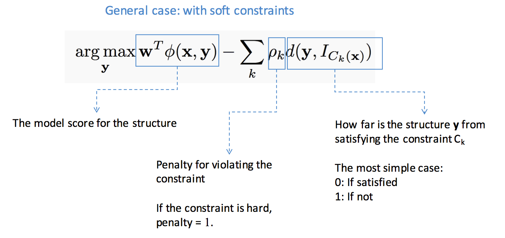

* TOC
{:toc}

# introduction

1. *structured prediction* - have multiple independent output variables
  - output assignments are evaluated jointly
  - requires joint (global) inference
  - can't use classifier because output space is combinatorially large
  - three steps
    1. model - pick a model
    2. learning = training
    3. inference = testing
2. *representation learning* - picking features
  - usually use domain knowledge
  1. combinatorial - ex. map words to higher dimensions
  2. hierarchical - ex. first layers of CNN

# structure

- structured output can be represented as a graph
- outputs y
- inputs x
- two types of info are useful
  - relationships between x and y
  - relationships betwen y and y
- complexities
  1. modeling - how to model?
  2. train - can't train separate weight vector for each inference outcome
  3. inference - can't enumerate all possible structures
- need to score nodes and edges
  - could score nodes and edges independently
  - could score each node and its edges together

# sequential models

 

## sequence models
- goal: learn distribution $P(x_1,...,x_n)$ for sequences $x_1,...,x_n$
  - ex. text generation
- *discrete Markov model*
  - $P(x_1,...,x_n) = \prod_i P(x_i \vert  x_{i-1})$
  - requires 
    1. initial probabilites
    2. transition matrix
- *mth order Markov model* - keeps history of previous m states
- each state is an observation

## conditional models and local classifiers - discriminative model
- conditional models = discriminative models
  - goal: model $P(Y\vert X)$
  - learns the decision boundary only
  - ignores how data is generated (like generative models)
- ex. *log-linear models*
  - $P(\mathbf{y\vert x,w}) = \frac{exp(w^T \phi (x,y))}{\sum_y' exp(w^T \phi (x,y'))}$
  - training: $w = \underset{w}{argmin} \sum log \: P(y_i\vert x_i,w)$
- ex. *next-state model*
  - $P(\mathbf{y}\vert \mathbf{x})=\prod_i P(y_i\vert y_{i-1},x_i)$
- ex. *maximum entropy markov model*
  - $P(y_i\vert y_{i-1},x) \propto exp( w^T \phi(x,i,y_i,y_{i-1}))$
    - adds more things into the feature representation than HMM via $\phi$
  - has *label bias* problem
    - if state has fewer next states they get high probability
      - effectively ignores x if $P(y_i\vert y_{i-1})$ is too high
- ex. *conditional random fields=CRF* 
  - a global, undirected graphical model
    - divide into *factors*
  - $P(Y\vert x) = \frac{1}{Z} \prod_i exp(w^T \phi (x,y_i,y_{i-1}))$
    - $Z = \sum_{\hat{y}} \prod_i exp(w^T \phi (x,\hat{y_i},\hat{y}_{i-1}))$
    - $\phi (x,y) = \sum_i \phi (x,y_i,y_{i-1})$
  - prediction via Viterbi (with sum instead of product)
  - training
    - maximize log-likelihood $\underset{W}{max} -\frac{\lambda}{2} w^T w + \sum log \: P(y_I\vert x_I,w)$
    - requires inference
  - *linear-chain CRF* - only looks at current and previous labels
- ex. *structured perceptron*
  - HMM is a linear classifier

# constrained conditional models

## consistency of outputs and the value of inference
- ex. POS tagging - sentence shouldn't have more than 1 verb
- *inference*
  - a global decision comprising of multiple local decisions and their inter-dependencies
  1. local classifiers
  2. constraints
- *learning*
  - global - learn with inference (computationally difficult)

## hard constraints and integer programs

-  

## soft constraints
-  

# inference

- inference constructs the output given the model
- goal: find highest scoring state sequence
  - $argmax_y \: score(y) = argmax_y w^T \phi(x,y)$
- naive: score all and pick max - terribly slow
- *viterbi* - decompose scores over edges
- questions
  1. exact v. approximate inference
    - exact - search, DP, ILP
    - approximate = *heuristic* - Gibbs sampling, belief propagation, beam search, linear programming relaxations
  2. randomized v. deterministic
    - if run twice, do you get same answer
- *ILP* - integer linear programs
  - combinatorial problems can be written as integer linear programs
  - many commercial solvers and specialized solvers
  - NP-hard in general
  - special case of *linear programming* - minimizing/maximizing a linear objective function subject to a finite number of linear constraints (equality or inequality)
    - in general, $ c = \underset{c}{argmax}\: c^Tx $ subject to $Ax \leq b$
    - maybe more constraints like $x \geq 0$
    - the constraint matrix defines a polytype
    - only the vertices or faces of the polytope can be solutions
    - $\implies$ can be solved in polynomial time
  - in ILP, each $x_i$ is an integer
  - *LP-relaxation* - drop the integer constraints and hope for the best
  - 0-1 ILP - $\mathbf{x} \in \{0,1\}^n$
  - decision variables for each label $z_A = 1$ if output=A, 0 otherwise
  - don't solve multiclass classification with an ILP solver (makes it harder)
- *belief propagation*
  - variable elimination
    1. fix an ordering of the variables
    2. iteratively, find the best value given previous neighbors
      - use DP
    - ex. Viterbi is max-product variable elimination
  - when there are loops, require approximate solution
    - uses *message passing* to determine marginal probabilities of each variable
      - message $m_{ij}(x_j)$ high means node i believes $P(x_j)$ is high
    - use *beam search* - keep size-limited priority queue of states

# learning protocols

## structural svm
- $\underset{w}{min} \: \frac{1}{2} w^T w + C \sum_i \underset{y}{max} (w^T \phi (x_i,y)+ \Delta(y,y_i) - w^T \phi(x_i,y_i) )$

## empirical risk minimization
- subgradients
  - ex. $f(x) = max ( f_1(x), f_2(x))$, solve the max then compute gradient of whichever function is argmax

## sgd for structural svm
- highest scoring assignment to some of the output random variables for a given input?
- *loss-augmented inference* - which structure most violates the margin for a given scoring function?
- *adagrad* - frequently updated features should get smaller learning rates