* TOC
{:toc}

---

# 16 lower
- sensory in dorsal spinal cord, motor in ventral
  - farther out neurons control farther out body parts (medial=trunk, lateral=arms,legs)
- one motor neuron (MN) innervates multiple fibers
  - the more fibers/neuron, the less precise
  - *MN pool* - group of MNs=motor units
- muscle tone = all your muscles are a little on, kind of like turning on the car engine and when you want to, you can move forward
  - more firing = more contraction
- MN types
  1. fast fatiguable - white muscle
  2. fast fatigue-resistant
  3. slow - red muscles, make atp
  - muscles are innervated by a proportion of these MNs
- reflex
  - whenever you get positive signal on one side, also get negative on other
  - *flexor* - curl in (bicep)
  - *extensor* - extend (tricep)
1. proprioceptors (+) - measure length - more you stretch, more firing of alpha MN to contract
  - *intrafusal muscle=spindle* - stretches the proprioceptor so that it can measure even when muscle is already stretched
    - $\gamma$ motor neuron - adjusts intrafusal muscles until they are just right
      - keeps muscles tight so you know how much muscle is streteched
      - if alpha fires a lot, gamma will increase as well
        - high gamma allows for fast responsiveness - brainstem modulators (serotonin) also do this
    - opposes muscle stretch to keep it fixed
    - spindle -> activates muscles -> contracts -> turns off
    - sensory neurons / gamma MNs innervate muscle spindle
  - homonymous MNs go into same muscle, antagonistic muscle pushes other way
2. *golgi tendon* (-) measures pressure not stretch
  - safety switch
  - inhibits homonymous neuron so you don't rip muscle off
- *ALS* = Lou Gehrig's disease 
  - MNs are degenerating - reflexes don't work
  - progressive loss of $\alpha$ MNs
  - last neuron to go is superior rectus muscle -> people use eyes to talk with tracker
- *CPG* = central pattern generator 
  - ex. step on pin, lift up leg
  - walking works even if you cut cat's spinal cord
  - collection of interneurons

# 17 upper
- 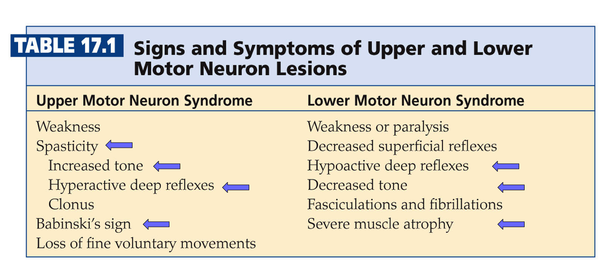
- 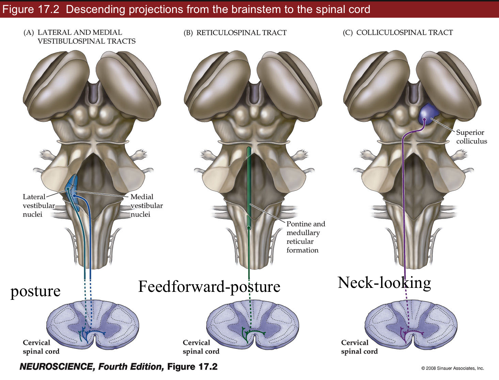
- 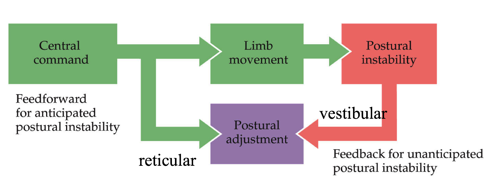
- 
- cAMP is used by GPCR
- lift and hold circuit
  1. ctx->*lateral white matter*->lateral ventral horn->limb muscles
    - lateral white matter - most sensitive to injury
  2. brainstem->*medial white matter*->medial horn->trunk
    - medial white matter -> goes into trunk
- *bulbarspinal tracts*
  1. lateral and medial *vestibulospinal* tracts - feedback
    - automated system - not much thinking
    - posture - reflex
    - too slow for learning surfing
  2. *reticular* - feedforward = anticipate things before they happen
    - command / control system for trunk muscles (posture)
    - feedforward - not a reflex, lean back before opening drawer
    - *caudal pontine* - feeds into spinal cord
  3. *colliculospinal* tract
    - has *superior colliculus* - eye muscles, neck-looking
    - see ch. 20 - reflex
- *corticular bulbar tract* (premotor->primary motor->brainstem)
  - motor cortexes - this info is *descending*
  - can override reticular reflexes in reticular formation
  - premotor cortex (P2) - contains all actions you can do
    - has *mirror neurons* that fire ahead of primary neurons
      - fire if you think about it or if you do it
  - primary motor cortex (P1)
    - layer 1 ascending
    - layer 4 input
    - layer 5 - *Betz cells* - behave like 6 (output)
    - layer 6 - descending output
    - has map like S1 does
      - *Jacksonian march* get seizure that goes from feet to face (usually one side)
        - epileptic seizure - neurons fire too much and fire neurons near them
          - *insular* - flashes of moods
          - *pyriform* - flashes of smells
  - *Betz cells* - if they fire, you will do something
    - dictate a goal, not single neuron to fire
    - axons to *ventral horn* of spinal cord
- lesions
  1. upper
    - *spasticity* - unorganized leg motions
    - increased tone - tight muscles
    - hyperactive deep reflexes
      - ex. *babinski's sign* 
      - curl foot down a lot because you don't know how much to curl
      - curling foot down = *normal plantar*
      - more serotonin can cause this
  2. lower
    - hypoactive deep reflexes
    - decreased tone
    - severe muscle atrophy 
- pathways
  - Betz cell
    - 90% cross midline in brainstem - control limbs
    - 10% don't cross - trunk muscles

# 18 basal ganglia (choose what you want to do)
- 
- 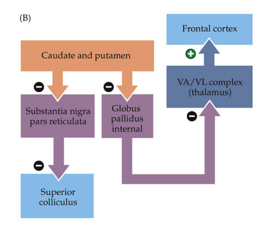
- 
- "who you are"
- outputs
  1. brainstem
  2. motor cortex
- 4 loops (last 2 aren't really covered)
  - motor loops
    1. *body movement loop*
      - *SnC -> S (CP) -> (-) Gp -> (-) VA/VL -> motor cortex*
    2. *oculomotor loop*
      - *cortex -> caudate -> substantia nigra pars reticulata -> superior colliculus*
  - non-motor loops
    3. *prefrontal loop* - daydreaming (higher-order function)
      - spiny neurons corresponding to a silly idea (alien coming after you) filtered out because not fired enough
      - schizophrenia - can't filter that out
    4. *limbic loop* - mood
      - has *nucleus accumbens*
      - can make mood better with dopamine
- *substantia nigra*
  1. *pars compacta* - dopaminergic neurons (input to striatum)
    - more dopamine = more strength between cortical pyramidal neurons and spiny neurons (turns up the gain)
    - dopamine helps activate a spiny neuron
    - may be the ones that learn (positive outcome is saved, will result in more dopamine later)
    - *Parkinson's* - specific loss of dopaminergic neurons
      - dopaminergic neurons form *melanin* = dark color
      - when you get down to 20% what you were born with
      - know what they need to do - don't have enough dopamine to act
      - treat with L Dopa -> something like dopamine -> take out globus pallidus
    - cocaine, amphetamine - too much dopamine
    - *Huntington's* - death of specific class of spiny neurons
      - have uncontrolled actions
    - *Tourette's* - too much dopamine
      - also alcohol
    - MPPP (synthetic heroin)
      - MPTP looks like dopamine but turns into MPP and kills dopaminergic neurons
      - treated with L Dopa to reactivate spiny neurons
  2. *pars reticulata* 
    - doesn't have dopamine (output from striatum)
1. *striatum* contains spiny neurons
  1. *caudate* (for vision) - output to globus pallidus and substantia nigra (pars reticulata)
  2. *putamen* - output only to globus pallidus
  - each spiny neuron gets input from ~1000 cortical pyramidal cells
2. *globus pallidus*
  - each spiny neuron connects to one globus pallidus neuron
  - deja vu - spiny neuron you haven't fired in a while
3. *VA/VL* (thalamus)
  - all motor actions must go through here before cortex
  - has series of commands of all actions you can do
  - has parallel set of betz cells that will illicit those actions
  - VA/VL is always firing, globus pallidus inhibits it (tonic connection)

# 19 cerebellum (fine tuning all your motion)
- 
- 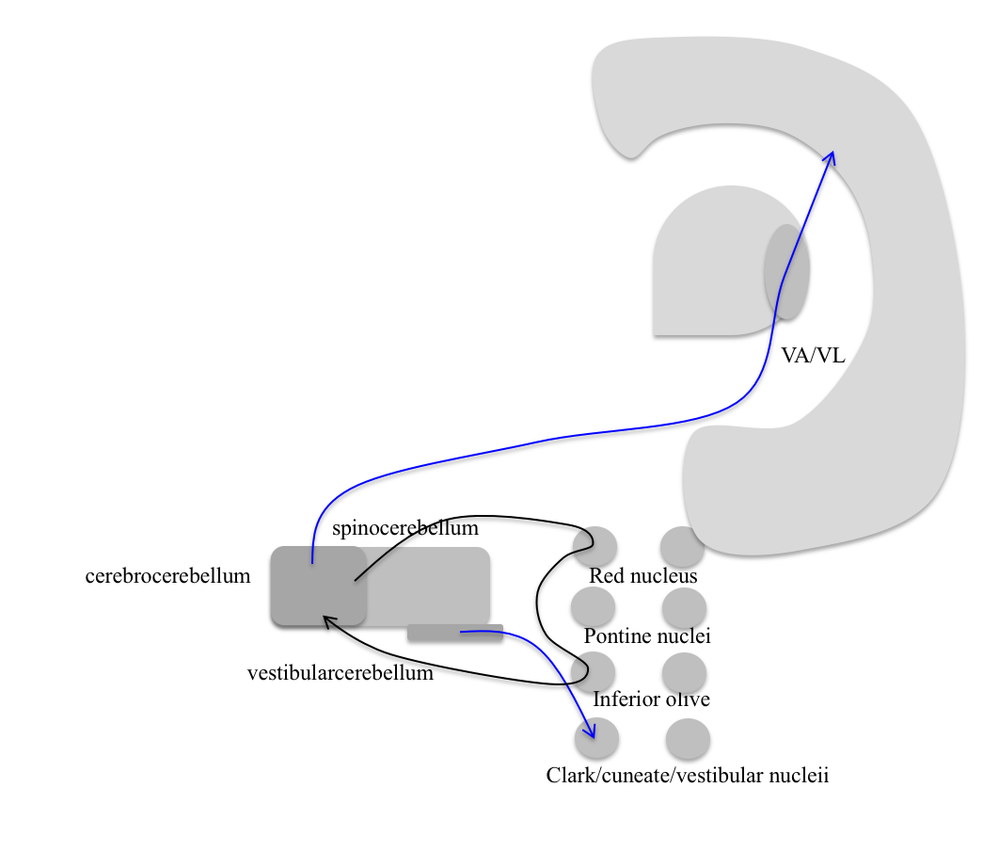
- 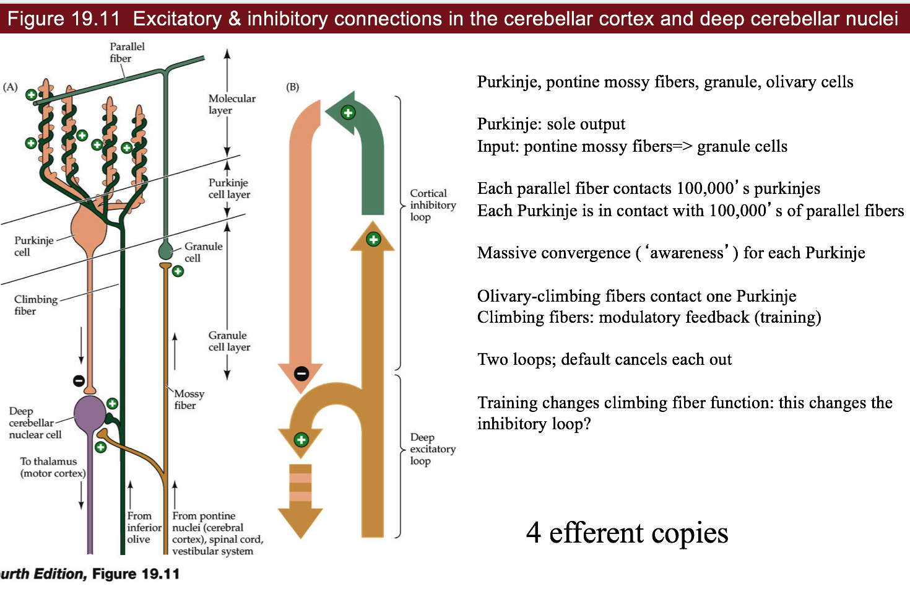
- 
- 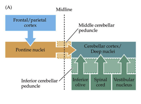
- 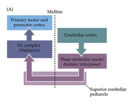
- 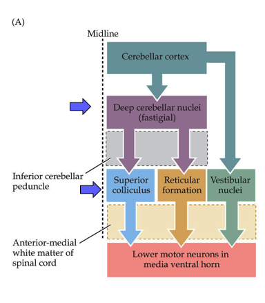
- redundant system - cortex could do all of this, but would be slow
- repeated circuit - interesting for neuroscientists
- all info comes in, gets processed and goes back out
  - cerebellum gets motor *efferant copy*
  - all structures on your brain that do processing send out efferent
  - cerebellum sends efferant copy back to itself with time delay (through inferior olive)
1. *cerebrocerebellum*
   - deals with premotor cortex (mostly motor cortex)
2. *spinocerebellum* = *clarke’s nucleus*, knows stretch of every muscle, many proprioceptors go straight into here
  - motor cortex
  - has a map of muscles
3. *vestibular cerebellum* - vestibular->cerebellum->vestibular
  - vestibular system leans you back but if wind blows, have to adjust to that
- input
  - *pontine* nuclei (from cortex)
  - *vestibular* nuclei (balance)
  - *cuneate* nucleus (somatosensory from spinal upper body)
  - *clarke* (proprio from spinal lower body)
- processing
  - cerebellar deep nuclei
- output
  - deep cerebellar nuclei
    - go to superior colliculus, reticular formation
  - VA/VL (thalamus) - back to cortex
  - red nucleus
- circuit 1 - fine-tuning
- circuit 2 - detects differences, adjusts
  - cerebellum -> *red nucleus* (is an efferant copy) -> *inferior olive* -> cerebellum
  - compare new copy to old copy 
- cells
  - *purkinje cells* - huge number of dendrite branches		- dead planar allows good imaging
    - GABAergic
  - (input) mossy fibers -(+)> granule cells (send parallel fibers) -(+)> purkinje cell -(-)> deep cerebellar nuclei (output)
    1. *mossy->granule->parallel fibers* connect to ~100,000 parallel fibers
    2. *climbing fiber* - comes from inferior olive and goes back to purkinje cell (this is the efferent copy) = training signal
  - loops
    - deep excitatory loop (climbing/mossy) -(+)-> deep cerebellar nuclei
    - cortical inhibitory loop (climbing/granule) -(+)-> purkinje
      - the negative is from purkinje to deep cerebellar nuclei
- alcohol 
  - can create gaps = *folia*
  - long-term use causes degeneration = *ataxia* (lack of coordination)

# 20 eye movements/integration
- 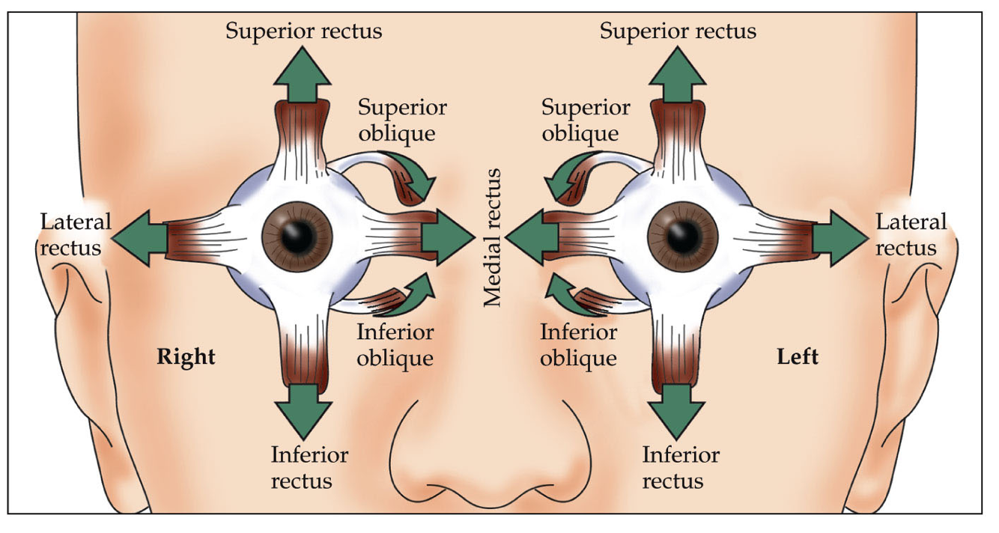
- 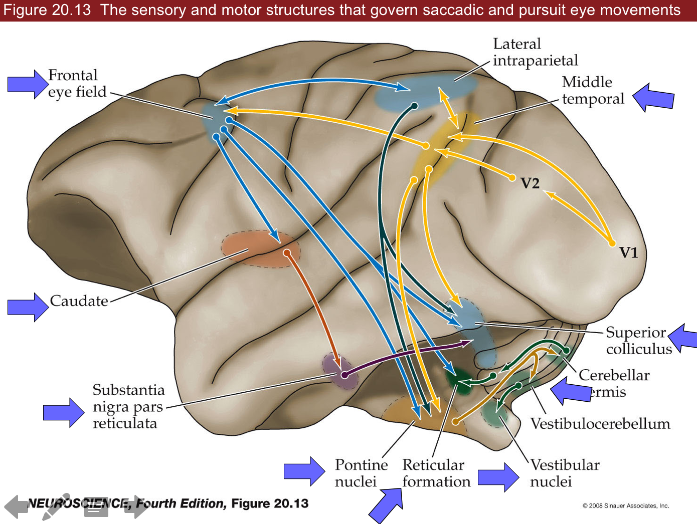
- Broca's view - look at people with problems
- Ramon y Cajal - look at circuits
- 5 kinds of eye movements
  1. *saccades*
    - use cortex, superior colliculus (visual info -> LGN -> cortex, 10% goes to brainstem)
    - constantly moving eyes around (fovea)
    - ~scan at 30 Hz
    - 5 Hz=200 ms for cortex to process so pause eyes (get 5-6 images)
      - there is a little bit of drift
    - can't control this
    - humans are better than other animals at seeing things that aren't moving
  2. *VOR* - vestibular ocular reflex - keeps eyes still
    - use vestibular system, occurs in comatose
    - fast
    - works better if you move your head fast
  3. *optokinetic system* - tracks with eyes
    - ex. stick head out window of car and track objects as they go by
    - slower than VOR (takes 200 ms)
    - works better if slower
    - reflex
    - in cortex (textbooks) but probs brainstem (new)
  4. *smooth pursuit* - can track things moving very fast
    - suppress saccades and track smoothly
    - only in higher apes
    - *area MT* is highest area of motion coding and goes up and comes down multiple ways
    - high speed processing isn't understood
       - could be retina processing
  5. *vergence* - crossing your eyes
    - suppresses conjugate eye movements
    - we can control this
    - only humans - bring objects up very close
    - reading uses this
- eye muscles
  - rectus
    - vertical
      - superior
      - inferior
      - use complicated *vertical gaze center*
        - last to degenerate in ALS
        - *locked-in syndrome* - can only move eyes vertically
        - controls oculomotor nucleus
    - lateral
      - medial
      - lateral (controlled by *abducens*)
      - use *horizontal gaze center=PPRF* which talk to abducens
        -*MLF* connects abducents to opposite medial lateral rectus muscle
    - oblique - more circular motions
      - superior (controlled by *trochlear nucleus*)
      - inferior
  - everything else controlled by *oculomotor nucleus*
- *superior colliculus* has visual map
  - controls saccades, connects to gaze centers
  - takes input from basal ganglia (oculomotor loop)
  - also gets audio input from inferior colliculus (hear someone behind you and turn)
  - gets strokes
  - redundant with *frontal eye field* in secondary motor cortex
    - connects to superior colliculus, gaze center, and comes back
    - if you lose one of these, the other will replace it
    - if you lose both, can't saccade to that side

# 21 visceral (how you control organs, stress levels, etc.)
- 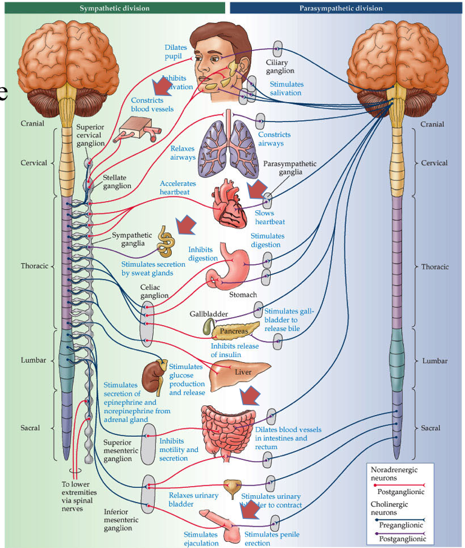
- 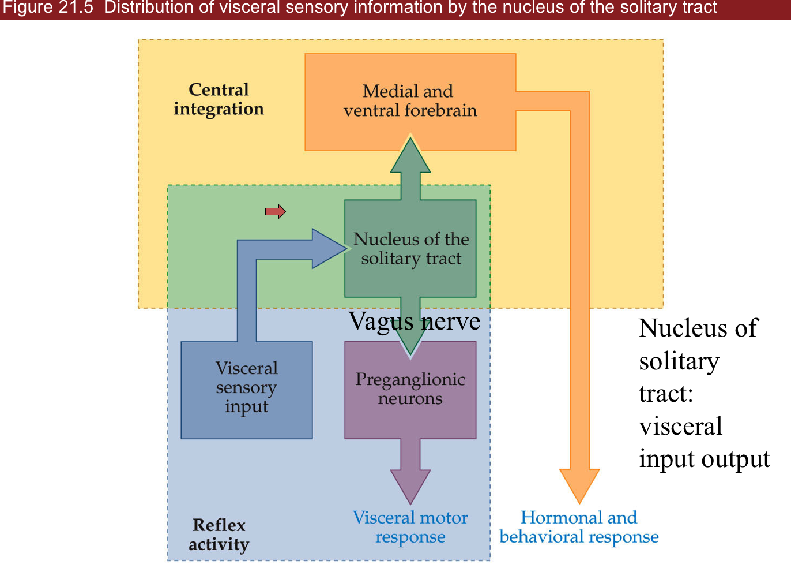
- 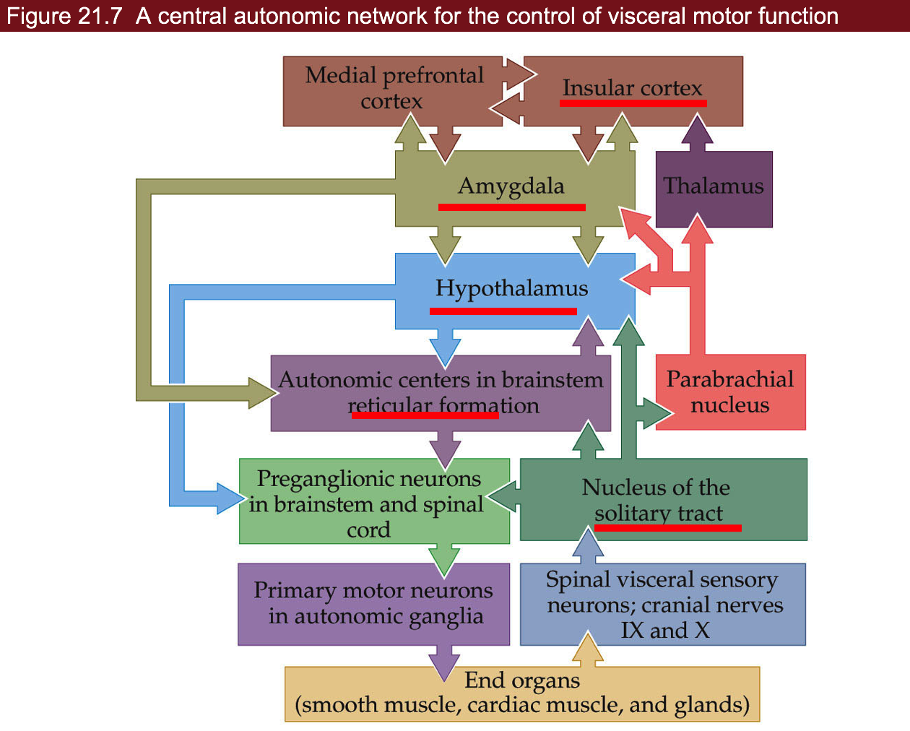
- 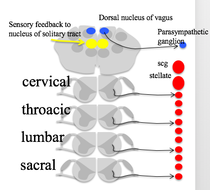
- parasympathetic works against sympathetic
- divisions
  1. *sympathetic* - fight-or-flight (*adrenaline*)
    - functions
      - neurons to smooth muscle
      - pupils dilate
      - increases heart rate
      - turn off digestive system
      - 2 things with no parasympathetic counterpart
        - increase BP
        - sweat glands
    - location
      - neurons in spinal cord lateral horn
        - send out neurons to sympathetic trunk (along the spinal cord)
        - all outgoing connections are adrenergic
    - beta-adrenergic drugs block adrenaline
      - beta agonist - activates adrenaline receptors (do this before EKG)
  2. *parasympathetic* - relaxing (*ACh*) 
    - location
      1. brainstem
        1. *edinger westphal nucleus* - pupil-constriction
        2. *salivatory nucleus*
        3. *vagus nucleus* - digestive system, sexual function
        4. *nucleus ambiguous* - heart
        5. **nucleus of the solitary tract**
          - all input/output goes through this
          1. *rostral* part (front) - taste neurons
          2. *caudal* part (back) contains all sensory information of viscera (ex. BP, heart rate, sexual 
      2. *sacral* spinal cord (bottom) - gut/bladder/genitals
      - not parallel to sympathetic – poor design - may cause stress-associated diseases 
    - hard to make drugs with ACh
  3. *enteric* nervous system - in your gut
    - takes input through *vagus nerve* from vagus nucleus
    - also has sensory neurons and sends afferents back to brainstem
- pathway 
  - *insular cortex* - what you care about
  - *amygdala* - contains emotional memories
  - *hypothalamus* - controls a lot
    - mostly peptinergin neurons
    - aging, digestion, mood, straight to bloodstream & CNS
    - releases hormones
    - ex. *leptin* - stops you eating when you eat calories
  - *reticular formation* - feedforward, prepares digestion before we eat
- three examples
  1. heart rate
    - starts at nucleus ambiguous
    - also takes input from chemoreceptors (ex. pH)
    - *SA node* at heart generates heartbeat - balances Ach and adrenaline
      - sympathetic sends info from thoracic spinal cord
    - heart sends back *baroreceptor afferents*
  2. bladder function
    1. parasympathetic in sacral lateral horn make you pee (contracts bladder)
    2. turn off sympathetic NS
    3. open sphincter muscle (voluntary)
    - can also control this via skeletal nervous system
    - circuit
      - *amygdala* (can't pee when nervous)
      - *pontine micturation center* -> *parasympathetic preganglionic neurons* -> *parasympathetic ganglionic neurons*
      - *inhibitory local* circuit neurons -> *somatic MNs*
  3. sexual function
    - *Viagra* turns on parasympathetic NS
      - also gives temporal color blindness
    - sympathetic involved in ejaculation
      - temporal correlation ("Point and Shoot")