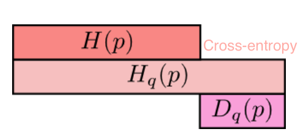

* TOC
{:toc}
- *material from* Cover "Elements of Information Theory"

# entropy

- $H(X) = - \sum p(x) log p(x) = E[h(p)]$
  - $h(p)= - log(p)$
  - $H(p)$ implies p is binary
  - usually for discrete variables only
  - assume 0 log 0 = 0

- intuition
  - higher entropy $\implies$ more uniform
  - lower entropy $\implies$ more pure
  1. expectation of variable $W=W(X)$, which assumes the value $-log(p_i)$ with probability $p_i$
  2. minimum, average number of binary questions (like is X=1?) required to determine value is between $H(X)$ and $H(X)+1$
  3. related to asymptotic behavior of sequence of i.i.d. random variables

- properties

  - $H(X) \geq 0$ since $p(x) \in [0, 1]$

- $H(Y\|X)=\sum p(x) H(Y\|X=x) = \sum_x \sum_y p(x) p(y|x) log \: p(y|x)$
  - $H(X,Y)=H(X)+H(Y\|X) =H(Y)+H(X\|Y)$

# relative entropy / mutual info

- *relative entropy* = *KL divergence* - measures distance between 2 distributions
  - $$D(p\|\|q) = \sum_x p(x) log \frac{p(x)}{q(x)} = E_p log \frac{p(X)}{q(X)}$$
  - if we knew the true distribution p of the random variable, we could construct a code with average description length H(p). 
  - If, instead, we used the code for a distribution q, we would need H(p) + D(p\|\|q) bits on the average to describe the random variable.
  - $D(p\|\|q) \neq D(q\|\|p)$
  - properties
    - nonnegative
    - not symmetric

- *mutual info I(X; Y)*: how much you can predict about one given the other
  - $I(X; Y) = \sum_X \sum_y p(x,y) log \frac{p(x,y)}{p(x) p(y)} = D(p(x,y)\|\|p(x) p(y))$
  - $I(X; Y) =  -H(X,Y) + H(X) + H(Y))$
    - $=I(Y|X)$
    - $I(X; X) = H(X)$ so entropy sometimes called *self-information*

  

  - cross-entropy: $H_q(p) = -\sum_x p(x) \: log \: q(x)$

  

# chain rules

- *entropy* - $H(X_1, ..., X_n) = \sum_i H(X_i \| X_{i-1}, ..., X_1) = H(X_n \| X_{n-1}, ..., X_1) + ... + H(X_1)$
- *conditional mutual info* $I(X; Y\|Z) = H(X\|Z) - H(X\|Y,Z)$
  - $I(X_1, ..., X_n; Y) = \sum_i I(X_i; Y\|X_{i-1}, ... , X_1)$
- *conditional relative entropy* $D(p(y\|x) \|\| q(y\|x)) = \sum_x p(x) \sum_y p(y\|x) log \frac{p(y\|x)}{q(y\|x)}$
  - $D(p(x, y)\|\|q(x, y)) = D(p(x)\|\|q(x)) + D(p(y\|x)\|\|q(y\|x))$

# jensen's inequality

- *convex* - function lies below any chord
  - has positive 2nd deriv
  - linear functions are both convex and concave
- *Jensen's inequality* - if f is a convex function and X is an R.V., $f(E[X]) \leq E[f(X)]$
  - if f strictly convex, equality $\implies X=E[X]$
- implications
  - *information inequality* $D(p\|\|q) \geq 0$ with equality iff p(x)=q(x) for all x
  - $H(X) \leq log \|X\|$ where \|X\| denotes the number of elements in the range of X, with equality if and only X has a uniform distr
  - $H(X\|Y) \leq H(X)$ - information can't hurt
  - $H(X_1, ..., X_n) \leq \sum_i H(X_i)$

# axiomatic approach
- *fundamental theorem of information theory* - it is possible to transmit information through a noisy channel at any rate less than channel capacity with an arbitrarily small probability of error
  - to achieve arbitrarily high reliability, it is necessary to reduce the transmission rate to the *channel capacity*
- uncertainty measure axioms
  1. H(1/M,...,1/M)=f(M) is a montonically increasing function of M
  2. f(ML) = f(M)+f(L) where M,L $\in \mathbb{Z}^+$
  3. *grouping axiom*
  4. H(p,1-p) is continuous function of p
- $H(p_1,...,p_M) = - \sum p_i log p_i = E[h(p_i)]$
  - $h(p_i)= - log(p_i)$
  - only solution satisfying above axioms
  - H(p,1-p) has max at 1/2
- *lemma* - Let $p_1,...,p_M$ and $q_1,...,q_M$ be arbitrary positive numbers with $\sum p_i = \sum q_i = 1$. Then $-\sum p_i log p_i \leq - \sum p_i log q_i$. Only equal if $p_i = q_i \: \forall i$
  - intuitively, $\sum p_i log q_i$ is maximized when $p_i=q_i$, like a dot product
- $H(p_1,...,p_M) \leq log M$ with equality iff  all $p_i = 1/M$
- $H(X,Y) \leq H(X) + H(Y)$ with equality iff X and Y are independent
- $I(X,Y)=H(Y)-H(Y\|X)$
- sometimes allow p=0 by saying 0log0 = 0
- information $I(x)=log_2 \frac{1}{p(x)}=-log_2p(x)$
- reduction in uncertainty (amount of surprise in the outcome)
- if the probability of event happening is small and it happens the info is large
    - entropy $H(X)=E[I(X)]=\sum_i p(x_i)I(x_i)=-\sum_i p(x_i)log_2 p(x_i)$
- information gain $IG(X,Y)=H(Y)-H(Y\|X)$

    - $=-\sum_j p(x_j) \sum_i p(y_i\|x_j) log_2 p(y_i\|x_j)$
- parts
  1. random variable X taking on $x_1,...,x_M$ with probabilities $p_1,...,p_M$
  2. code alphabet = set $a_1,...,a_D$ . Each symbol $x_i$ is assigned to finite sequence of code characters called *code word* associated with $x_i$
  3. *objective* - minimize the average word length $\sum p_i n_i$ where $n_i$ is average word length of $x_i$
- code is *uniquely decipherable* if every finite sequence of code characters corresponds to at most one message
  - *instantaneous code* - no code word is a prefix of another code word
