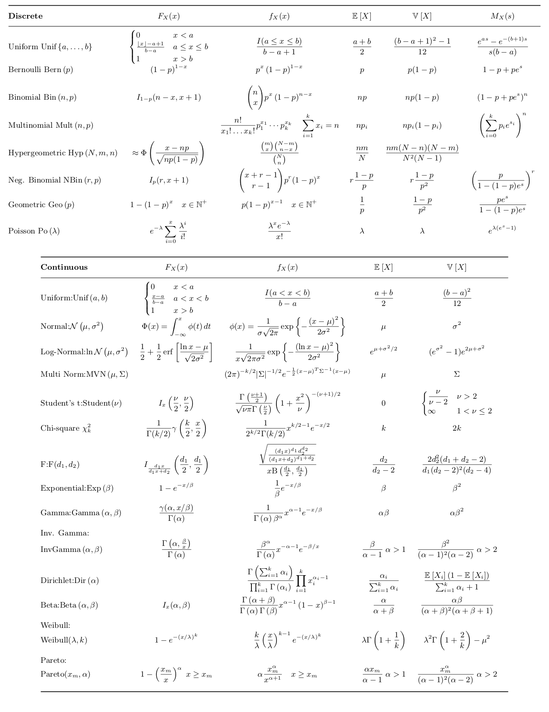

* TOC
{:toc}
# Resources

- material from probability and statistics cookbook by matthias vallentin

# Properties

- Mutually Exclusive: P(AB)=0
- Independent: P(AB) = P(A)P(B)
- Conditional: P(A \| B) = $\frac{P(AB)}{P(B)}$

# Measures
- $E[X] = \int P(x)x dx$
- $V[X] = E[(x-\mu)^2] = E[x^2]-E[x]^2$
  - for unbiased estimate, divide by n-1
- $Cov[X,Y] = E[(X-\mu_X)(Y-\mu_Y)] = E[XY]-E[X]E[Y]$
  - $Cor(Y,X) = \rho = \frac{Cov(Y,X)}{s_xs_y}$
  - $R^2 = \rho^2$
- linearity
  - $Cov(aX+bY,Z) = aCov(X,Z)+bCov(Y,Z)$
  - $V(a_1X_...+a_nX_n) =  \sum_{i=1}^{n}\sum_{j=1}^{n}a_ia_jcov(X_i,X_j)$
  - if $X_1,X_2$ independent, $V(X_1-X_2) = V(X_1) + V(X_2)$
- $f(X), X=v(Y), g(Y) = f(v(Y))$ \|$\frac{d}{dy}g^{-1}(y)$\|
- $g(y_1,y_2) = f(v_1,v_2)\|det(M)\|$ where M in row-major is $\frac{\partial v1}{y1}, \frac{\partial v1}{y2} ...$
- $Corr(aX+b,cY+d) = Corr(X,Y)$ if a and c have same sign
- $E[h(X)] \approx h(E[X])$
- $V[h(X)] \approx h'(E[X])^2 V[X]$
- skewness = $E[(\frac{X-\mu}{\sigma})^3]$

# Moment-generating function
- $M_X(t) = E(e^{tX})$
- $E(X^r) = M_X ^ {(r )} (0)$
- sometimes you can use $ln(M_x(t))$ to find $\mu$ and $V(X)$
- Y = aX+b $-> M_y(t) = e^{bt}M_x(at)$
- Y = $a_1X_1+a_2X_2 \to M_Y(t) = M_{X_1}(a_1t)M_{X_2}(a_2t)$ if $X_i$ independent
- probability plot  - straight line is better - plot ([100(i-.5)/n]the percentile, ith ordered observation)
- ordered statistics - variables $Y_i$ such that $Y_i$ is the ith smallest
- If X has pdf f(x) and cdf F(x), $G_n(y) = (F(y))^n$, $g_n(y) = n(F(y))^{n-1}f(y)$
  - If joint, $g(y_1,...y_n) = n!f(y_1)...f(y_n)$

  $g(y_i) = \frac{n!}{(i-1)!(n-i)!}(F(y_i))^{i-1}(1-F(y_i))^{n-1}f(y_i)​$

# Distributions

# Statistics and Sampling Distributions

- can calculated expected values of sample mean and sample $\sigma$ 2 ways: prob. rules and simulation (for simulation fix n and repeat k times)
- CLT - random samples have a normal distr. if n is large
- CLT: $lim_{n->\infty}P(\frac{\bar{X}-\mu}{\sigma/\sqrt{n}}\leq z)=P(Z\leq z) = \Phi(z)$
- CLT $\to Y = X_1*..*X_n$ has approximately lognormal distribution if all $P(X_i>0)$

### Law of Large Numbers 
- $ E(\bar{X}-\mu)^2 \to 0$ as $n \to \infty,$
- $ P(\|\bar{X}-\mu\| \geq \epsilon) \to 0$ as $n \to \infty$
- $T_o = X_1+...+X_n, E(T_o) = n\mu , V(T_o) = n\mu ^2$
- $E(\bar{X}) = \mu$
- $V(\bar{X}) = \frac{\sigma_x^2}{n}$
- chi-squared - finding the distribution for sums of squares of normal variables. 
- if $Z_1,..., Z_n$ are i.i.d. standard normal,then $Z_1^2+...+Z_n^2 = \chi_n^2$
- $(n-1)S^2/\sigma^2 \text{ proportional to } \chi_{n-1}^2$
- t - to use the sample standard deviation to measure precision for the mean X, we combine the square root of a chi-squared variable with a normal variable
- f - compare two independent sample variances in terms of the ratio of two independent chi-squared variables.

# Moment-generating function

- ​
- ​
- sometimes you can use  to find  and 
- Y = aX+b 
- Y =  if  independent
- probability plot  - straight line is better - plot ([100(i-.5)/n]the percentile, ith ordered observation)
- ordered statistics - variables  such that  is the ith smallest
- If X has pdf f(x) and cdf F(x), , 
  - If joint, 

# Point Estimation

- point estimate - single number prediction
- point estimator - statistic that predicts a parameter
- MSE - mean squared error  - $E[(\hat{\theta}-\theta)^2]$ = $V(\hat{\theta})+[E(\hat{\theta})-\theta]^2$
- *bias*: $E(\hat{\theta})=\theta$
  - after unbiased we want MVUE (minimum variance unbiased estimator)
- *bias/variance trade-off*
  - pf
    - 
  - defs
    - bias sometimes called approximation err
    - variance called estimation err
  - ex. ***estimator for kde***: $\hat{f_{n, h}(x)} = \frac{1}{n}\sum_i K_h (X_i - x)$
    - smooths voxel-wise output
    - $bias = E[\hat{f}(x)] - f(x) = f''(x)/2 \int t^t K(t) dt \cdot h^2$ + smaller order
    - $variance =Var[\hat{f}(x)] = 1/n^2 \sum Var[Y_i] + \frac{2}{n^2} \sum_{i<j} Cov(Y_i, Y_j)$
  - ex. $mse = E[\hat{f}_h(x) - f(x)]^2 = bias^2 + variance$
    - define *risk* = mean L2 err = $\int mse(x) dx$
      - minimizing this yields an asymptotically optimal bandwidth
- Estimators: $ \tilde{X} $ = Median, $X_e$ = Midrange((max+min)/2), $X_{tr(10)}=$ 10 percent trimmed mean (discard smallest and largest 10 percent)
- standard error: $\sigma_{\hat{\theta}} = s_{\hat{\sigma}} = \sqrt{Var(\hat{\theta)}}$ - determines *consistency*
  - consistent when converges in probability to the true value of the parameter
- $S^2 (Unbiased)= \sum{\frac{(X_i-\bar{X})^2}{n-1}}$
- $\hat{\sigma^2} (MLE) = \sum{\frac{(X_i-\mu)^2}{n}}$
- Can calculate estimators for a distr. by calculating moments
- A statistic T = t(X1, . . ., Xn) is said to be sufficient for making inferences about a parameter y if the joint distribution of X1, X2, . . ., Xn given that T = t does not depend upon y for every possible value t of the statistic T.
- Neyman Factorization Thm - $t(X_1,...,X_n)$ is sufficient $\leftrightarrow f = g(t,\theta)*h(x_1,...,x_n)$
- Estimating h($\theta$), if U is unbiased, T is sufficient for $\theta$, then use $U^* = E(U\|T)$
- Fisher Information $I(\theta)=V[\frac{\partial}{\partial\theta}ln(f(x;\theta))]$ (for n samples, multiply by n)
- If T is unbiased estimator for $\theta$ then $V(T) \geq \frac{1}{nI(\theta)}$
- Efficiency of T is ratio of lower bound to variance of T
- hypergeometric - number of success in n draws of (without replacement) of sample with m successes and N-m failures
- negative binomial - fix number of successes, X = number of trials before rth success
- normal - standardized: $\frac{X-\mu}{\sigma}$ (mean 0 and std.dev.=1)
- gamma: $ \Gamma (a) = \int_{0}^{\infty} x^{a-1}e^{-x}dx$, $\Gamma(1/2) = \sqrt{\pi}$

## MLE
- MLE - maximize $f(x_1,...,x_n;\theta_1,...\theta_m)$ - agreement with chosen distribution - often take ln(f) and then take derivative $\approx$ MVUE, but can be biased
- $\hat{\theta} = $argmax $  L(\theta)$
    - Likelihood $L(\theta)=P(X_1...X_n\|\theta)=\prod_{i=1}^n P(X_i\|\theta)$
    - $logL(\theta)=\sum log P(X_i\|\theta)$
    - to maximize, set $\frac{\partial LL(\theta)}{\partial \theta} = 0​$
- Use $\hat{\theta} = $argmax $  P(\text{Train} \| {Model}(\theta))$
